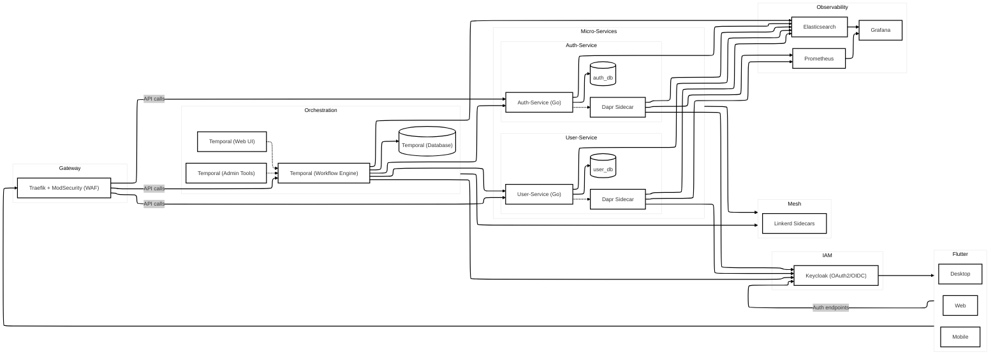

# Starter Kit SaaS B2B

> 🇫🇷 Pour voir la version française, cliquez [ici](./doc/fr/README.md).

This **starter kit** provides a robust, extensible, and secure foundation for developing a full-stack B2B SaaS, ready to run locally. It includes:

- **Frontend**: Flutter (Web / Mobile / Desktop)
- **API Gateway & WAF**: Traefik + ModSecurity
- **IAM**: Keycloak (OAuth2 / OIDC)
- **Orchestration**: Temporal (event-driven workflows)
- **Microservices**: Go, each with its own PostgreSQL database
- **Service Mesh**: Dapr, Linkerd (mTLS, load balancing, retries, circuit breaker, health checks)
- **Observability**: Prometheus, Grafana (metrics) and Elasticsearch (logs)

---

## Installation and Startup

```bash
docker compose -p SaaSter up -d
```

> **Note**: In a production environment, replace the development ACME certificates with trusted TLS certificates, and migrate to Kubernetes using your own manifests or Helm charts.

---

## Architecture Overview



All user requests pass first through **Traefik** (secure reverse proxy + WAF), then through **Temporal** for orchestrating workflows (registration, authentication, etc.) without direct coupling between microservices. **Keycloak** manages IAM, and **Linkerd** ensures mutual TLS, load balancing, and inter-service resilience. Finally, **Prometheus**, **Grafana**, and **Elasticsearch** deliver comprehensive observability.

---

## Best Practices Employed

- **Database-per-Service**: each microservice owns its own PostgreSQL database, isolating functional domains.
- **Event-Driven Orchestration**: Temporal guarantees atomicity and failure recovery for business workflows.
- **Zero-Trust & mTLS**: Linkerd’s service mesh enforces mutual authentication and encrypts internal communications.
- **Security “By Design”**: WAF via ModSecurity, rate limiting, OAuth2 scopes, token introspection, and TLS certificates.
- **Resilience Patterns**: retries, circuit breakers, health checks, bulkheads, and horizontal scalability.
- **12-Factor App**: configuration via environment variables, logging to stdout, stateless services, etc.
- **Observability**: centralized metrics and logs for rapid diagnostics.

---

## License

This project is released under the **MIT** license. See the [`LICENSE`](./LICENSE) file for more details.
