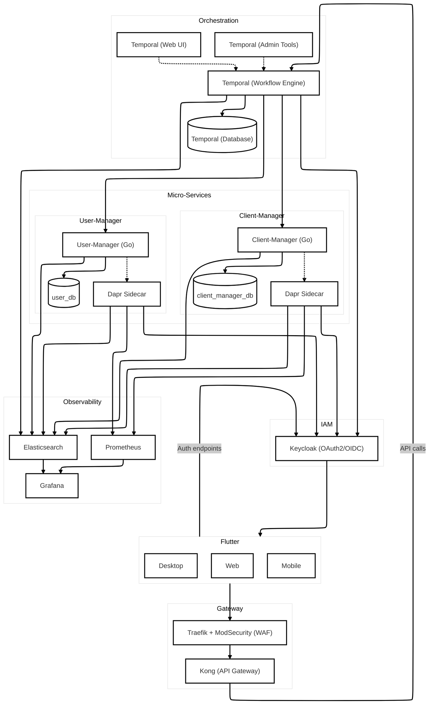

# Starter Kit SaaS B2B

> 🇫🇷 Pour voir la version française, cliquez [ici](./doc/fr/README.md).

This **starter kit** provides a robust, extensible, and secure foundation for developing a full-stack B2B SaaS, ready to run locally. It includes:

- **Frontend**: Flutter (Web / Mobile / Desktop)
- **API Gateway & WAF**: Traefik + ModSecurity + Kong
- **IAM**: Keycloak (OAuth2 / OIDC)
- **Orchestration**: Temporal (event-driven workflows)
  - Default namespace: Used for system workflows
  - Client namespace: Used for client management workflows
- **Microservices**: Go, each with its own PostgreSQL database
  - User Manager: Handles user registration and management
  - Client Manager: Manages client information and profiles
- **Service Mesh**: Dapr, Linkerd (mTLS, load balancing, retries, circuit breaker, health checks)
- **Observability**: Prometheus, Grafana (metrics) and Elasticsearch (logs)

---

## Installation and Startup

```bash
docker compose -p SaaSter up -d
```

> **Note**: In a production environment, replace the development ACME certificates with trusted TLS certificates, and migrate to Kubernetes using your own manifests or Helm charts.

---

## Architecture Overview



All user requests pass first through **Traefik** (secure reverse proxy + WAF), then through **Kong** (API Gateway) which routes to **Temporal** for orchestrating workflows (registration, authentication, etc.) without direct coupling between microservices. **Keycloak** manages IAM, and **Linkerd** ensures mutual TLS, load balancing, and inter-service resilience. Finally, **Prometheus**, **Grafana**, and **Elasticsearch** deliver comprehensive observability.

---

## API Gateway

The gateway architecture consists of three main components:

1. **Traefik**: Acts as the entry point and reverse proxy
   - TLS termination
   - Routing based on hostnames
   - Load balancing
   - Basic traffic management

2. **ModSecurity**: Web Application Firewall (WAF) for security
   - Protection against SQL injection
   - Cross-site scripting (XSS) prevention
   - Common web attacks mitigation
   - OWASP Top 10 vulnerabilities protection

3. **Kong**: API Gateway for managing API access
   - Authentication with Keycloak
   - JWT validation
   - Rate limiting
   - Request/response transformation
   - Service aggregation
   - Protocol translation (REST to gRPC for Temporal)

The following endpoints are available:

- **API Gateway**: http://api.localhost
  - `/api/v1/workflows/*` - Temporal Workflow API
  - `/api/v1/namespaces/*` - Temporal Namespace API
  - `/temporal/*` - Temporal UI
  - `/auth/*` - Keycloak authentication

Access the Traefik dashboard at: http://traefik.localhost:8090

### Using from Flutter

Example Flutter code to interact with Temporal through the gateway:

```dart
import 'dart:convert';
import 'package:http/http.dart' as http;

class TemporalClient {
  final String baseUrl;
  final String apiKey;
  final http.Client _httpClient = http.Client();

  TemporalClient({
    required this.apiKey,
    this.baseUrl = 'http://api.localhost/api/v1',
  });

  Future<String> startWorkflow({
    required String workflowType,
    required String taskQueue,
    required String workflowId,
    required Map<String, dynamic> input,
  }) async {
    final response = await _httpClient.post(
      Uri.parse('$baseUrl/workflows'),
      headers: {
        'Content-Type': 'application/json',
        'apikey': apiKey,
      },
      body: jsonEncode({
        'workflow_type': workflowType,
        'task_queue': taskQueue,
        'workflow_id': workflowId,
        'input': input,
      }),
    );

    if (response.statusCode != 200) {
      throw Exception('Failed to start workflow: ${response.body}');
    }

    final data = jsonDecode(response.body);
    return data['workflow_id'];
  }
}
```

## Best Practices Employed

- **Database-per-Service**: each microservice owns its own PostgreSQL database, isolating functional domains.
- **Event-Driven Orchestration**: Temporal guarantees atomicity and failure recovery for business workflows. See [Temporal Configuration Guide](./doc/temporal_configuration.md) for details on configuring Temporal for new microservices.
- **Zero-Trust & mTLS**: Linkerd’s service mesh enforces mutual authentication and encrypts internal communications.
- **Security “By Design”**: WAF via ModSecurity, rate limiting, OAuth2 scopes, token introspection, and TLS certificates.
- **Resilience Patterns**: retries, circuit breakers, health checks, bulkheads, and horizontal scalability.
- **12-Factor App**: configuration via environment variables, logging to stdout, stateless services, etc.
- **Observability**: centralized metrics and logs for rapid diagnostics.

---

## License

This project is released under the **MIT** license. See the [`LICENSE`](./LICENSE) file for more details.
