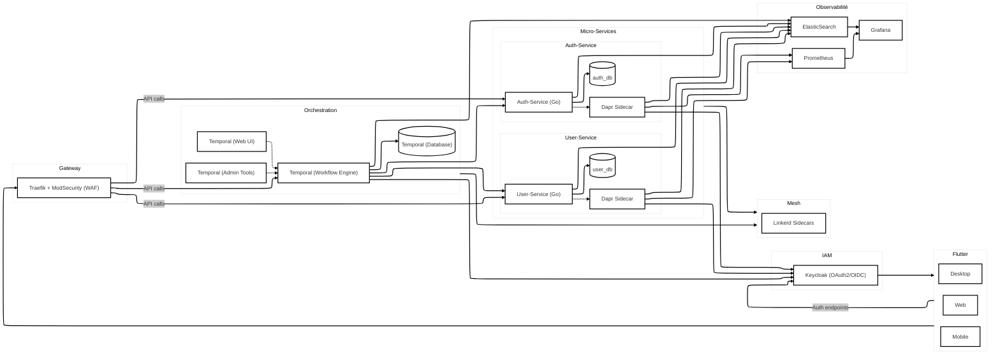

# Starter Kit SaaS B2B

Ce **starter kit** fournit une base robuste, modulable et sécurisée pour développer un SaaS B2B full-stack, prêt à l’emploi en local. Il intègre :

- **Frontend** : Flutter (Web / Mobile / Desktop)  
- **API Gateway & WAF** : Traefik + ModSecurity  
- **IAM** : Keycloak (OAuth2 / OIDC)  
- **Orchestration** : Temporal (workflows _event-driven_)  
- **Microservices** : Go, chacun avec sa propre base PostgreSQL  
- **Service mesh** : Dapr, Linkerd (mTLS, load-balancing, retries, circuit-breaker, health checks)  
- **Observabilité** : Prometheus, Grafana (métriques) et ElasticSearch (logs)  

---

## Installation et démarrage

```bash
docker compose -p SaaSter up -d
```

> **Note** : en environnement de production, remplacez les certificats ACME de développement par des certificats TLS fiables, et migrez vers Kubernetes à l’aide de vos manifests ou Helm charts.

---

## Description de l’architecture


Chaque appel utilisateur transite d’abord par **Traefik** (reverse-proxy sécurisé + WAF), puis par **Temporal** pour les workflows (inscription, authentification, etc.) sans couplage direct entre microservices. **Keycloak** gère l’IAM, et **Linkerd** assure le chiffrement mutuel, l’équilibrage de charge et la résilience inter-services. Enfin, **Prometheus**, **Grafana** et **ElasticSearch** offrent une visibilité complète.

---

## Bonnes pratiques respectées

- **Database-per-Service** : chaque microservice possède sa propre base PostgreSQL, isolant les domaines fonctionnels.
- **Event-Driven Orchestration** : Temporal garantit l’atomicité et la reprise sur échec des workflows métier.
- **Zero-Trust & mTLS** : Linkerd maillant les services assure une authentification mutuelle et un chiffrement des communications internes.
- **Sécurité “By Design”** : WAF ModSecurity, rate-limiting, scopes OAuth2, introspection de jetons et certificats TLS.
- **Résilience** : patterns *retry*, *circuit breaker*, *health checks*, *bulkheads* et *scalabilité horizontale*.
- **12-Factor App** : configuration via variables d’environnement, logs sur stdout, stateless services, etc.
- **Observabilité** : métriques et logs centralisés pour un diagnostic rapide.

---

## Licence

Ce projet est distribué sous licence **MIT**. Consultez le fichier [`LICENSE`](./LICENSE) pour plus de détails.
