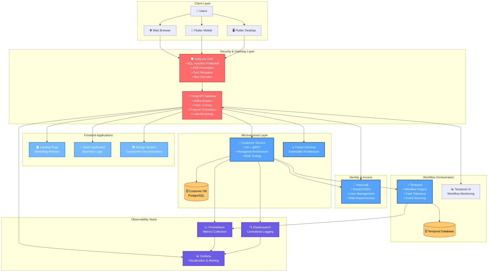
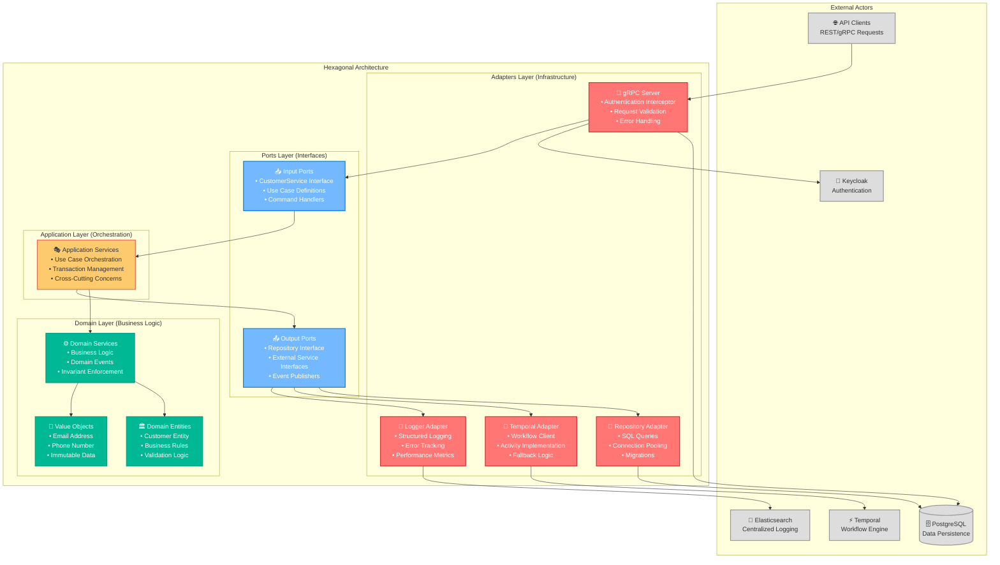
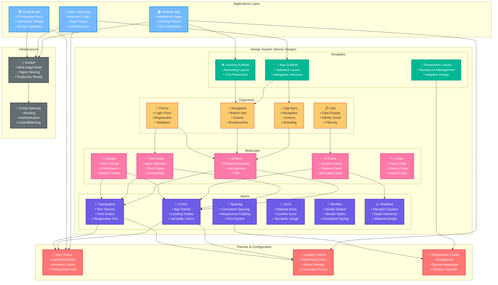

# SaaS B2B Starter Kit

This **production-ready starter kit** provides a comprehensive, enterprise-grade foundation for developing scalable B2B SaaS applications. Built with modern security, authentication, and orchestration technologies, it accelerates your development process while ensuring robust protection and reliability.

## Key Features & Recent Enhancements

- **Enhanced Security Stack**: SafeLine Web Application Firewall (WAF) integration provides advanced protection against SQL injection, XSS, DoS attacks, bot threats, and OWASP Top 10 vulnerabilities
- **Frontend Applications**: Flutter-based cross-platform solutions (Web / Mobile / Desktop)
    - Landing Page: Marketing website with Material UI and atomic design pattern
    - SaaS Application: Full-featured business application with authentication and microservices integration
    - Design System: Comprehensive component library with responsive and adaptive design
- **API Gateway & Security**: Kong + SafeLine WAF
    - Kong: Enterprise API Gateway for routing, authentication, rate limiting, and protocol translation
    - SafeLine: Advanced Web Application Firewall with real-time threat detection and mitigation
- **Identity & Access Management**: Keycloak (OAuth2 / OIDC)
    - Enterprise-grade authentication and authorization
    - Multi-tenant user management and role-based access control
- **Workflow Orchestration**: Temporal (fault-tolerant business processes)
    - Temporal: Reliable workflow engine for complex business logic
    - Temporal UI: Comprehensive monitoring and management interface
- **Microservices Architecture**: Go-based services with hexagonal architecture
    - Customer Service: Example microservice with complete CRUD operations
    - Database-per-service pattern with PostgreSQL
    - gRPC communication with REST API translation
- **Complete Observability**: Production-ready monitoring and logging
    - Prometheus: Metrics collection and storage
    - Grafana: Advanced visualization and alerting
    - Elasticsearch: Centralized logging and trace analysis

---

## Installation and Startup

```bash
docker compose -p saaster up -d
```

> **Note**: In a production environment, replace the development ACME certificates with trusted TLS certificates, and
> migrate to Kubernetes using your own manifests or Helm charts.

---

## Architecture Overview

The SaaSter Kit follows a modern, cloud-native architecture designed for scalability, security, and maintainability. The system is built around three core architectural patterns: microservices with hexagonal architecture, atomic design for the frontend, and a comprehensive security-first approach.

### Infrastructure Architecture


```mermaid
graph TB
    subgraph "Client Layer"
        Users[👥 Users]
        Mobile[📱 Flutter Mobile]
        Desktop[🖥️ Flutter Desktop]
        Browser[🌐 Web Browser]
    end

    subgraph "Security & Gateway Layer"
        SafeLine[🛡️ SafeLine WAF<br/>• SQL Injection Protection<br/>• XSS Prevention<br/>• DoS Mitigation<br/>• Bot Detection]
        Kong[🚪 Kong API Gateway<br/>• Authentication<br/>• Rate Limiting<br/>• Protocol Translation<br/>• Load Balancing]
    end

    subgraph "Frontend Applications"
        Website[🏠 Landing Page<br/>Marketing Website]
        MainApp[💼 SaaS Application<br/>Business Logic]
        Widgetbook[📚 Design System<br/>Component Documentation]
    end

    subgraph "Identity & Access"
        Keycloak[🔐 Keycloak<br/>• OAuth2/OIDC<br/>• User Management<br/>• Role-Based Access]
    end

    subgraph "Workflow Orchestration"
        Temporal[⚡ Temporal<br/>• Workflow Engine<br/>• Fault Tolerance<br/>• Event Sourcing]
        TemporalUI[📊 Temporal UI<br/>Workflow Monitoring]
        TemporalDB[(🗄️ Temporal Database)]
    end

    subgraph "Microservices Layer"
        CustomerService[👤 Customer Service<br/>• Go + gRPC<br/>• Hexagonal Architecture<br/>• BDD Testing]
        CustomerDB[(🗄️ Customer DB<br/>PostgreSQL)]
        FutureServices[➕ Future Services<br/>Extensible Architecture]
    end

    subgraph "Observability Stack"
        Prometheus[📈 Prometheus<br/>Metrics Collection]
        Grafana[📊 Grafana<br/>Visualization & Alerting]
        Elasticsearch[🔍 Elasticsearch<br/>Centralized Logging]
    end

    %% Connections
    Users --> Browser
    Users --> Mobile
    Users --> Desktop

    Browser --> SafeLine
    Mobile --> SafeLine
    Desktop --> SafeLine

    SafeLine --> Kong
    Kong --> Website
    Kong --> MainApp
    Kong --> Widgetbook
    Kong --> TemporalUI
    Kong --> Grafana

    Kong <--> Keycloak
    Kong --> CustomerService
    Kong --> FutureServices

    CustomerService --> CustomerDB
    CustomerService --> Temporal
    CustomerService --> Keycloak
    CustomerService --> Prometheus
    CustomerService --> Elasticsearch

    Temporal --> TemporalDB
    Temporal --> Prometheus

    Prometheus --> Grafana
    Elasticsearch --> Grafana

    %% Styling
    classDef security fill:#ff6b6b,stroke:#d63031,stroke-width:2px,color:#fff
    classDef frontend fill:#74b9ff,stroke:#0984e3,stroke-width:2px,color:#fff
    classDef backend fill:#55a3ff,stroke:#2d3436,stroke-width:2px,color:#fff
    classDef data fill:#fdcb6e,stroke:#e17055,stroke-width:2px,color:#000
    classDef observability fill:#6c5ce7,stroke:#5f3dc4,stroke-width:2px,color:#fff

    class SafeLine,Kong security
    class Website,MainApp,Widgetbook frontend
    class CustomerService,FutureServices,Keycloak,Temporal backend
    class CustomerDB,TemporalDB data
    class Prometheus,Grafana,Elasticsearch observability
```

**Architectural Rationale:**

- **Security-First Design**: SafeLine WAF provides the first line of defense against web attacks, while Kong handles authentication and authorization. This layered security approach ensures comprehensive protection.

- **API Gateway Pattern**: Kong centralizes cross-cutting concerns like authentication, rate limiting, and protocol translation, reducing complexity in individual microservices.

- **Database-per-Service**: Each microservice owns its data, ensuring loose coupling and independent scalability.

- **Workflow Orchestration**: Temporal manages complex business processes with built-in fault tolerance and retry mechanisms, eliminating the need for custom workflow logic.

- **Comprehensive Observability**: The combination of Prometheus (metrics), Grafana (visualization), and Elasticsearch (logging) provides complete system visibility.

### Go Microservices Architecture (Hexagonal Pattern)


```mermaid
graph TB
    subgraph "External Actors"
        Client[🌐 API Clients<br/>REST/gRPC Requests]
        Database[(🗄️ PostgreSQL<br/>Data Persistence)]
        TemporalExt[⚡ Temporal<br/>Workflow Engine]
        AuthService[🔐 Keycloak<br/>Authentication]
        LogService[📝 Elasticsearch<br/>Centralized Logging]
    end

    subgraph "Hexagonal Architecture"
        subgraph "Adapters Layer (Infrastructure)"
            GRPCAdapter[🔌 gRPC Server<br/>• Authentication Interceptor<br/>• Request Validation<br/>• Error Handling]
            RepoAdapter[🔌 Repository Adapter<br/>• SQL Queries<br/>• Connection Pooling<br/>• Migrations]
            TemporalAdapter[🔌 Temporal Adapter<br/>• Workflow Client<br/>• Activity Implementation<br/>• Fallback Logic]
            LogAdapter[🔌 Logger Adapter<br/>• Structured Logging<br/>• Error Tracking<br/>• Performance Metrics]
        end

        subgraph "Ports Layer (Interfaces)"
            InPorts[📥 Input Ports<br/>• CustomerService Interface<br/>• Use Case Definitions<br/>• Command Handlers]
            OutPorts[📤 Output Ports<br/>• Repository Interface<br/>• External Service Interfaces<br/>• Event Publishers]
        end

        subgraph "Domain Layer (Business Logic)"
            Entities[🏛️ Domain Entities<br/>• Customer Entity<br/>• Business Rules<br/>• Validation Logic]
            ValueObjects[💎 Value Objects<br/>• Email Address<br/>• Phone Number<br/>• Immutable Data]
            DomainServices[⚙️ Domain Services<br/>• Business Logic<br/>• Domain Events<br/>• Invariant Enforcement]
        end

        subgraph "Application Layer (Orchestration)"
            AppServices[🎭 Application Services<br/>• Use Case Orchestration<br/>• Transaction Management<br/>• Cross-Cutting Concerns]
        end
    end

    %% External connections
    Client --> GRPCAdapter
    GRPCAdapter --> Database
    RepoAdapter --> Database
    TemporalAdapter --> TemporalExt
    LogAdapter --> LogService
    GRPCAdapter --> AuthService

    %% Internal connections
    GRPCAdapter --> InPorts
    InPorts --> AppServices
    AppServices --> DomainServices
    AppServices --> OutPorts
    OutPorts --> RepoAdapter
    OutPorts --> TemporalAdapter
    OutPorts --> LogAdapter

    DomainServices --> Entities
    DomainServices --> ValueObjects

    %% Styling
    classDef external fill:#ddd,stroke:#999,stroke-width:2px
    classDef adapter fill:#ff7675,stroke:#d63031,stroke-width:2px,color:#fff
    classDef port fill:#74b9ff,stroke:#0984e3,stroke-width:2px,color:#fff
    classDef domain fill:#00b894,stroke:#00a085,stroke-width:2px,color:#fff
    classDef application fill:#fdcb6e,stroke:#e17055,stroke-width:2px

    class Client,Database,TemporalExt,AuthService,LogService external
    class GRPCAdapter,RepoAdapter,TemporalAdapter,LogAdapter adapter
    class InPorts,OutPorts port
    class Entities,ValueObjects,DomainServices domain
    class AppServices application
```

**Hexagonal Architecture Benefits:**

- **Testability**: Domain logic can be tested in isolation without external dependencies
- **Flexibility**: External systems can be replaced without affecting business logic
- **Maintainability**: Clear separation of concerns makes the codebase easier to understand
- **Technology Independence**: Domain is not tied to specific frameworks or databases

### Flutter Frontend Architecture (Atomic Design)


```mermaid
graph TB
    subgraph "Applications Layer"
        Website[🏠 Website App<br/>• Marketing Pages<br/>• Landing Theme<br/>• SEO Optimized]
        MainApp[💼 Main SaaS App<br/>• Business Logic<br/>• App Theme<br/>• Authentication]
        Widgetbook[📚 Widgetbook<br/>• Component Docs<br/>• Interactive Testing<br/>• Design Validation]
    end

    subgraph "Design System (Atomic Design)"
        subgraph "Templates"
            AppScaffold[📱 App Scaffold<br/>• Standard Layout<br/>• Navigation Structure]
            LandingScaffold[🌐 Landing Scaffold<br/>• Marketing Layout<br/>• CTA Placement]
            ResponsiveLayout[📐 Responsive Layout<br/>• Breakpoint Management<br/>• Adaptive Design]
        end

        subgraph "Organisms"
            AppBars[🎯 App Bars<br/>• Navigation<br/>• Actions<br/>• Branding]
            Navigation[🧭 Navigation<br/>• Bottom Nav<br/>• Drawer<br/>• Breadcrumbs]
            Forms[📝 Forms<br/>• Login Form<br/>• Registration<br/>• Validation]
            Lists[📋 Lists<br/>• Data Display<br/>• Infinite Scroll<br/>• Filtering]
        end

        subgraph "Molecules"
            Buttons[🔘 Buttons<br/>• Primary/Secondary<br/>• Icon Buttons<br/>• FAB]
            TextFields[📝 Text Fields<br/>• Input Validation<br/>• Error States<br/>• Accessibility]
            Cards[🃏 Cards<br/>• Content Cards<br/>• Feature Cards<br/>• Elevated Cards]
            Dialogs[💬 Dialogs<br/>• Alert Dialogs<br/>• Confirmation<br/>• Bottom Sheets]
            Chips[🏷️ Chips<br/>• Filter Chips<br/>• Choice Chips<br/>• Action Chips]
        end

        subgraph "Atoms"
            Colors[🎨 Colors<br/>• App Palette<br/>• Landing Palette<br/>• Semantic Colors]
            Typography[📝 Typography<br/>• Text Themes<br/>• Font Scales<br/>• Responsive Text]
            Spacing[📏 Spacing<br/>• Consistent Spacing<br/>• Responsive Padding<br/>• Grid System]
            Icons[🎯 Icons<br/>• Material Icons<br/>• Custom Icons<br/>• Semantic Usage]
            Borders[🔲 Borders<br/>• Border Radius<br/>• Border Styles<br/>• Consistent Styling]
            Shadows[🌫️ Shadows<br/>• Elevation System<br/>• Depth Hierarchy<br/>• Material Design]
        end
    end

    subgraph "Themes & Configuration"
        AppTheme[🎨 App Theme<br/>• Light/Dark Mode<br/>• Business Colors<br/>• Professional Look]
        LandingTheme[🌈 Landing Theme<br/>• Marketing Colors<br/>• Brand Identity<br/>• Conversion Focus]
        ResponsiveConfig[📱 Responsive Config<br/>• Breakpoints<br/>• Device Adaptation<br/>• Platform Specific]
    end

    subgraph "Infrastructure"
        Docker[🐳 Docker<br/>• Multi-stage Build<br/>• Nginx Serving<br/>• Production Ready]
        Kong[🚪 Kong Gateway<br/>• Routing<br/>• Authentication<br/>• Load Balancing]
    end

    %% Application dependencies
    Website --> LandingScaffold
    Website --> LandingTheme
    MainApp --> AppScaffold
    MainApp --> AppTheme
    Widgetbook --> AppTheme

    %% Template dependencies
    AppScaffold --> AppBars
    AppScaffold --> Navigation
    LandingScaffold --> Navigation
    ResponsiveLayout --> ResponsiveConfig

    %% Organism dependencies
    AppBars --> Buttons
    Navigation --> Buttons
    Forms --> TextFields
    Forms --> Buttons
    Lists --> Cards

    %% Molecule dependencies
    Buttons --> Colors
    Buttons --> Typography
    TextFields --> Colors
    TextFields --> Typography
    Cards --> Colors
    Cards --> Shadows
    Dialogs --> Colors
    Dialogs --> Typography

    %% Atom relationships
    Colors --> AppTheme
    Colors --> LandingTheme
    Typography --> AppTheme
    Typography --> LandingTheme
    Spacing --> ResponsiveConfig

    %% Infrastructure
    Website --> Docker
    MainApp --> Docker
    Widgetbook --> Docker
    Docker --> Kong

    %% Styling
    classDef app fill:#74b9ff,stroke:#0984e3,stroke-width:2px,color:#fff
    classDef template fill:#00b894,stroke:#00a085,stroke-width:2px,color:#fff
    classDef organism fill:#fdcb6e,stroke:#e17055,stroke-width:2px
    classDef molecule fill:#fd79a8,stroke:#e84393,stroke-width:2px,color:#fff
    classDef atom fill:#6c5ce7,stroke:#5f3dc4,stroke-width:2px,color:#fff
    classDef theme fill:#ff7675,stroke:#d63031,stroke-width:2px,color:#fff
    classDef infra fill:#636e72,stroke:#2d3436,stroke-width:2px,color:#fff

    class Website,MainApp,Widgetbook app
    class AppScaffold,LandingScaffold,ResponsiveLayout template
    class AppBars,Navigation,Forms,Lists organism
    class Buttons,TextFields,Cards,Dialogs,Chips molecule
    class Colors,Typography,Spacing,Icons,Borders,Shadows atom
    class AppTheme,LandingTheme,ResponsiveConfig theme
    class Docker,Kong infra
```

**Atomic Design Benefits:**

- **Consistency**: Shared design tokens ensure visual consistency across all applications
- **Reusability**: Components can be used across website, main app, and future applications
- **Maintainability**: Changes to atoms automatically propagate to all dependent components
- **Documentation**: Widgetbook provides interactive documentation for all components
- **Responsive Design**: Built-in responsive behavior adapts to all screen sizes and devices

---

## API Gateway & Security Layer

The SaaSter Kit implements a robust, multi-layered security architecture combining Kong API Gateway with SafeLine Web Application Firewall for comprehensive protection and traffic management.

### Kong API Gateway

Kong serves as the central entry point for all API traffic, providing enterprise-grade features:

- **Security & Authentication**: OAuth2/OIDC integration with Keycloak for API endpoints
- **Traffic Management**: Intelligent routing, load balancing, and rate limiting
- **Protocol Translation**: Seamless REST to gRPC conversion using gRPC-Gateway plugin
- **Request Processing**: Request/response transformation and service aggregation
- **TLS Termination**: Centralized SSL/TLS certificate management

### SafeLine Web Application Firewall

SafeLine provides advanced security protection against modern web threats:

- **Attack Prevention**: Comprehensive protection against SQL injection, XSS, code injection, command injection, CRLF injection, XXE, SSRF, and path traversal attacks
- **Bot Protection**: Advanced anti-bot challenges with interactive verification to distinguish human users from automated threats
- **DoS Mitigation**: Intelligent rate limiting and traffic surge protection to prevent denial-of-service attacks
- **Dynamic Security**: Real-time HTML and JavaScript code encryption to prevent client-side attacks
- **Access Control**: Configurable authentication challenges for restricted areas and sensitive routes
- **Monitoring & Analytics**: Real-time traffic analysis, attack detection, and comprehensive security event logging

### Security Integration

SafeLine integrates seamlessly with Kong through the `kong-safeline` plugin, creating a unified security layer:

- **Global Protection**: All traffic passing through Kong is automatically inspected by SafeLine
- **Layered Defense**: Kong handles authentication and authorization while SafeLine focuses on attack prevention
- **Performance Optimization**: Minimal latency impact through efficient traffic processing
- **Centralized Management**: Single point of configuration for both gateway and security policies

### Available Endpoints

**API Gateway**: http://localhost
- `/api/v1/customer` - Customer management API (OAuth2 authentication required)
- `/api/v1/customers` - Customer listing API (OAuth2 authentication required)
- `/temporal/*` - Temporal workflow monitoring interface
- `/auth/*` - Keycloak identity management portal
- `/grafana/*` - Observability and metrics dashboard

**Security Management**: https://localhost:9443 (SafeLine WAF dashboard)


## Security Features & Protection Modes

### SafeLine WAF Protection Capabilities

SafeLine operates in two distinct protection modes to balance security and usability:

**Balance Mode** (Default Development):
- Moderate protection with minimal false positives
- Suitable for development and testing environments
- Allows legitimate traffic while blocking obvious threats

**Strict Mode** (Recommended Production):
- Maximum security with comprehensive threat detection
- Enhanced protection against sophisticated attacks
- Stricter validation rules and challenge mechanisms

### Advanced Security Features

- **OWASP Top 10 Protection**: Complete defense against the most critical web application security risks
- **Intelligent Bot Detection**: Machine learning-based bot identification with customizable challenge responses
- **Behavioral Analysis**: Real-time user behavior monitoring to detect anomalous patterns
- **Geo-blocking**: Location-based access control and threat intelligence integration
- **Custom Rule Engine**: Flexible rule creation for application-specific security requirements
- **Zero-Day Protection**: Proactive defense against unknown vulnerabilities through behavioral analysis

### Management & Monitoring

**SafeLine Management Console**: https://localhost:9443
- **Default Credentials**: admin/admin (change immediately in production)
- **Real-time Dashboard**: Live traffic monitoring and threat visualization
- **Attack Analytics**: Detailed attack reports with threat classification and source analysis
- **Rule Management**: Custom protection rule creation and modification
- **Performance Metrics**: WAF performance impact and processing statistics
- **Alert Configuration**: Customizable notifications for security events

**Integration Benefits**:
- **Seamless Operation**: Transparent protection without application code changes
- **High Performance**: Optimized processing with minimal latency impact
- **Scalable Architecture**: Handles high-traffic applications with horizontal scaling
- **Compliance Support**: Assists with PCI DSS, GDPR, and other regulatory requirements

For comprehensive configuration guides and advanced features, see the [SafeLine WAF Documentation](./infra/safeline/README.md).

## Enterprise Best Practices

The SaaSter Kit implements industry-standard best practices for building production-ready B2B SaaS applications:

### Architecture Patterns
- **Database-per-Service**: Each microservice maintains its own PostgreSQL database, ensuring data isolation and independent scaling
- **Hexagonal Architecture**: Clean separation between business logic and external dependencies for improved testability and maintainability
- **Event-Driven Orchestration**: Temporal workflows provide reliable, fault-tolerant business process management with automatic retry and recovery

### Security & Compliance
- **Defense in Depth**: Multi-layered security with SafeLine WAF, Kong authentication, and OAuth2/OIDC integration
- **Zero-Trust Architecture**: No implicit trust between services, with comprehensive authentication and authorization
- **Security by Design**: Built-in protection against OWASP Top 10 vulnerabilities and modern attack vectors
- **Compliance Ready**: Architecture supports PCI DSS, GDPR, and other regulatory requirements

### Reliability & Resilience
- **Circuit Breaker Pattern**: Prevents cascade failures and improves system stability
- **Health Checks**: Comprehensive monitoring of service health and automatic recovery
- **Graceful Degradation**: Services continue operating with reduced functionality during partial failures
- **Horizontal Scalability**: Container-based architecture supports elastic scaling based on demand

### Development & Operations
- **12-Factor App Methodology**: Environment-based configuration, stateless services, and proper logging practices
- **Infrastructure as Code**: Docker Compose configuration enables consistent environments across development and production
- **Comprehensive Testing**: BDD testing with Gherkin scenarios ensures business requirements are met
- **Complete Observability**: Integrated monitoring with Prometheus, Grafana, and Elasticsearch for full system visibility

---

## Accessible Websites

Once the Kong API Gateway is running, the following web interfaces/applications become available:

| Website      | URL                         | Description                                                                            | Authentication                     |
|--------------|-----------------------------|----------------------------------------------------------------------------------------|------------------------------------|
| Landing Page | http://localhost/           | Main website with marketing content and call-to-action elements                        | No authentication required         |
| SaaS App     | http://localhost/app        | Main SaaS application with user authentication and authorization                       | Uses its own authentication system |
| Widgetbook   | http://localhost/widgetbook | Interactive documentation and testing for design system components                     | No authentication required         |
| Keycloak     | http://localhost/auth       | Identity and Access Management (IAM) service for user authentication and authorization | Uses its own authentication system |
| Temporal UI  | http://localhost/temporal   | Web interface for monitoring and managing Temporal workflows                           | Uses its own authentication system |
| Grafana      | http://localhost/grafana    | Dashboard for metrics visualization and monitoring                                     | Uses its own authentication system |
| SafeLine UI  | https://localhost/safeline  | Web Application Firewall management interface                                          | admin/admin (default)              |
| Kong Admin   | http://localhost/kong-admin | API Gateway administration interface                                                   | No authentication required         |

### API Endpoints

The following API endpoints are available through the Kong API Gateway:

| API Endpoint      | HTTP Method | Description                   | Authentication  |
|-------------------|-------------|-------------------------------|-----------------|
| /api/v1/customer  | GET         | Retrieve customer information | OAuth2 required |
| /api/v1/customer  | PUT         | Add a new customer            | OAuth2 required |
| /api/v1/customer  | POST        | Update customer information   | OAuth2 required |
| /api/v1/customers | GET         | List all customers            | OAuth2 required |

## Documentation Summary

This project contains extensive documentation across various components. Below is a comprehensive summary of all
available documentation:

### Backend

- [Backend Overview](./backend/README.md) - Overview of the backend architecture, including microservices, hexagonal
  architecture, and CQRS pattern.
    - [Customer Service](./backend/customer_service/README.md) - Documentation for the customer service microservice,
      including API endpoints, Temporal workflows, and architecture.

### Frontend

- [Frontend Overview](./frontend/README.md) - Documentation for the Flutter applications, including web, mobile, and
  desktop clients.
- [Design System](./frontend/design_system/README.md) - Comprehensive Flutter design system using Material UI and atomic
  design pattern with responsive components.
    - [Widgetbook](./frontend/design_system/widgetbook/README.md) - Interactive showcase and documentation of design
      system components using Widgetbook.
- [Website](./frontend/website/README.md) - Documentation for the Flutter-based marketing website and landing pages.

### Infrastructure

- [Infrastructure Overview](./infra/README.md) - Overview of the infrastructure components, including Docker Compose
  configuration.
- [Keycloak](./infra/keycloak/README.md) - Documentation for Keycloak configuration, including realms, clients, and
  users.
- [Kong API Gateway](./infra/kong/README.md) - Detailed guide for Kong API Gateway, including configuration, routes, and
  plugins.
- [SafeLine WAF](./infra/safeline/README.md) - Guide for SafeLine Web Application Firewall configuration and usage.
- [Temporal](./infra/temporal/README.md) - Comprehensive documentation for Temporal workflow engine, including
  configuration, workflows, and activities.
  - [Temporal Dynamic Config](./infra/temporal/dynamicconfig/README.md) - Guide for configuring Temporal's dynamic
    configuration settings for different namespaces and task queues.

## License

This project is released under the **MIT** license. See the [`LICENSE`](./LICENSE) file for more details.
