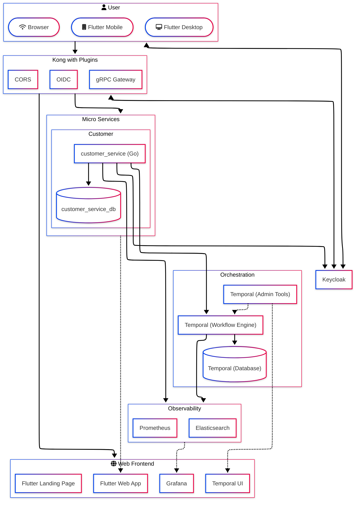

# Starter Kit SaaS B2B

This **starter kit** provides a robust, extensible, and secure foundation for developing a full-stack B2B SaaS, ready to run locally. It includes:

- **Frontend**: Flutter (Web / Mobile / Desktop)
- **API Gateway & WAF**: Traefik + ModSecurity + Kong
- **IAM**: Keycloak (OAuth2 / OIDC)
- **Orchestration**: Temporal (event-driven workflows)
  - Default namespace: Used for system workflows
  - Client namespace: Used for client management workflows
- **Microservices**: Go, each with its own PostgreSQL database
  - Client Manager: Manages client information and profiles
- **Service Mesh**: Dapr, Linkerd (mTLS, load balancing, retries, circuit breaker, health checks)
- **Observability**: Prometheus, Grafana (metrics) and Elasticsearch (logs)

---

## Installation and Startup

```bash
docker compose -p SaaSter up -d
```

> **Note**: In a production environment, replace the development ACME certificates with trusted TLS certificates, and migrate to Kubernetes using your own manifests or Helm charts.

---

## Architecture Overview


```mermaid
---
config:
  theme: neo
  layout: elk
  look: neo
---
flowchart TD
    subgraph client["fa:fa-user User"]
        mobile(["fa:fa-mobile Flutter Mobile"])
        desktop(["fa:fa-desktop Flutter Desktop"])
        chrome(["fa:fa-wifi Browser"])
    end
    subgraph kong["Kong with Plugins"]
        oidc["OIDC"]
        grpc-gateway["gRPC Gateway"]
        cors["CORS"]
    end
    subgraph front["fa:fa-globe Web Frontend"]
        web["Flutter Web App"]
        landing["Flutter Landing Page"]
        temporal["Temporal UI"]
        grafana["Grafana"]
    end
    subgraph orch["Orchestration"]
        D["Temporal (Workflow Engine)"]
        D1["Temporal (Admin Tools)"]
        D3[("Temporal (Database)")]
    end
    subgraph customer["Customer"]
        customer-service["customer_service (Go)"]
        customer-db[("customer_service_db")]
    end
    subgraph ms["Micro Services"]
        customer
    end
    subgraph obs["Observability"]
        promoteus["Prometheus"]
        elasticsearch["Elasticsearch"]
    end
    D --> D3
    D1 -.-> D
    customer-service --> customer-db & iam["Keycloak"] & D & obs
    obs -.-> grafana
    D1 -.-> temporal
    ms -.-> web
    D --> obs
    client --> kong
    kong --> front & ms
    kong <--> iam
    client <--> iam
```

All user requests pass first through **Traefik** (secure reverse proxy + WAF), then through **Kong** (API Gateway) which routes to **Temporal** for orchestrating workflows (registration, authentication, etc.) without direct coupling between microservices. **Keycloak** manages IAM, and **Linkerd** ensures mutual TLS, load balancing, and inter-service resilience. Finally, **Prometheus**, **Grafana**, and **Elasticsearch** deliver comprehensive observability.

---

## API Gateway

The gateway architecture consists of three main components:

1. **Traefik**: Acts as the entry point and reverse proxy
   - TLS termination
   - Routing based on hostnames
   - Load balancing
   - Basic traffic management

2. **ModSecurity**: Web Application Firewall (WAF) for security
   - Protection against SQL injection
   - Cross-site scripting (XSS) prevention
   - Common web attacks mitigation
   - OWASP Top 10 vulnerabilities protection

3. **Kong**: API Gateway for managing API access
   - Authentication with OAuth2 for API endpoints
   - Frontend applications access without authentication
   - Rate limiting
   - Request/response transformation
   - Service aggregation
   - Protocol translation (REST to gRPC)
   - gRPC-Gateway for REST to gRPC conversion

The following endpoints are available:

- **API Gateway**: http://localhost
  - `/api/v1/customer` - Customer API (GET, PUT, POST)
  - `/api/v1/customers` - List Customers API (GET)
  - `/temporal/*` - Temporal UI (no authentication required)
  - `/auth/*` - Keycloak authentication (no authentication required)
  - `/grafana/*` - Grafana dashboard (no authentication required)

Access the Traefik dashboard at: http://traefik.localhost:8090

### REST to gRPC Mapping

Kong API Gateway is configured to map REST endpoints to gRPC methods for the customer service:

| REST Endpoint | HTTP Method | gRPC Method |
|---------------|-------------|-------------|
| `/api/v1/customer` | GET | GetCustomer |
| `/api/v1/customer` | PUT | AddCustomer |
| `/api/v1/customer` | POST | UpdateCustomer |
| `/api/v1/customers` | GET | ListCustomers |

This mapping is achieved using the gRPC-Gateway plugin in Kong, which translates between REST and gRPC protocols. The configuration includes:

1. **Protocol Translation**: Converting REST requests to gRPC calls
2. **Authentication Propagation**: Passing OAuth2 tokens to backend services
3. **Content Type Conversion**: Handling JSON to Protocol Buffers conversion

### Using from Flutter

Example Flutter code to interact with the API Gateway:

```dart
import 'dart:convert';
import 'package:http/http.dart' as http;

class CustomerClient {
  final String baseUrl;
  final String token;
  final http.Client _httpClient = http.Client();

  CustomerClient({
    required this.token,
    this.baseUrl = 'http://localhost/api/v1',
  });

  Future<Map<String, dynamic>> getCustomer(String id) async {
    final response = await _httpClient.get(
      Uri.parse('$baseUrl/customer?id=$id'),
      headers: {
        'Content-Type': 'application/json',
        'Authorization': 'Bearer $token',
      },
    );

    if (response.statusCode != 200) {
      throw Exception('Failed to get customer: ${response.body}');
    }

    return jsonDecode(response.body);
  }

  Future<Map<String, dynamic>> addCustomer(Map<String, dynamic> customerData) async {
    final response = await _httpClient.put(
      Uri.parse('$baseUrl/customer'),
      headers: {
        'Content-Type': 'application/json',
        'Authorization': 'Bearer $token',
      },
      body: jsonEncode(customerData),
    );

    if (response.statusCode != 200) {
      throw Exception('Failed to add customer: ${response.body}');
    }

    return jsonDecode(response.body);
  }
}
```

## Best Practices Employed

- **Database-per-Service**: each microservice owns its own PostgreSQL database, isolating functional domains.
- **Event-Driven Orchestration**: Temporal guarantees atomicity and failure recovery for business workflows. See [Temporal Configuration Guide](./doc/temporal_configuration.md) for details on configuring Temporal for new microservices.
- **Zero-Trust & mTLS**: Linkerd's service mesh enforces mutual authentication and encrypts internal communications.
- **Security "By Design"**: WAF via ModSecurity, rate limiting, OAuth2 authentication for APIs, separate authentication for frontend applications, token propagation, and TLS certificates.
- **Resilience Patterns**: retries, circuit breakers, health checks, bulkheads, and horizontal scalability.
- **12-Factor App**: configuration via environment variables, logging to stdout, stateless services, etc.
- **Observability**: centralized metrics and logs for rapid diagnostics.

---

## Accessible Websites

Once the Kong API Gateway is running, the following web interfaces/applications become available:

| Website | URL | Description | Authentication |
|---------|-----|-------------|---------------|
| Landing Page | http://localhost/ | Main website with marketing content and call-to-action elements | No authentication required |
| Keycloak | http://localhost/auth | Identity and Access Management (IAM) service for user authentication and authorization | Uses its own authentication system |
| Temporal UI | http://localhost/temporal | Web interface for monitoring and managing Temporal workflows | Uses its own authentication system |
| Grafana | http://localhost/grafana | Dashboard for metrics visualization and monitoring | Uses its own authentication system |


### API Endpoints

The following API endpoints are available through the Kong API Gateway:

| API Endpoint | HTTP Method | Description | Authentication |
|--------------|-------------|-------------|---------------|
| /api/v1/customer | GET | Retrieve customer information | OAuth2 required |
| /api/v1/customer | PUT | Add a new customer | OAuth2 required |
| /api/v1/customer | POST | Update customer information | OAuth2 required |
| /api/v1/customers | GET | List all customers | OAuth2 required |

## Documentation Summary

This project contains extensive documentation across various components. Below is a summary of the available documentation:

### Backend

- [Backend Overview](./backend/README.md) - Overview of the backend architecture, including microservices, hexagonal architecture, and CQRS pattern.
- [Client Manager](./backend/client_manager/README.md) - Documentation for the client manager microservice, including API endpoints and data models.
- [Client Manager Tests](./backend/client_manager/tests/README.md) - Guide for running tests with Testcontainers for the client manager service.

### Frontend

- [Frontend Overview](./frontend/README.md) - Documentation for the Flutter applications, including web, mobile, and desktop clients.

### Infrastructure

- [Infrastructure Overview](./infra/README.md) - Overview of the infrastructure components, including Docker Compose configuration.
- [Keycloak](./infra/keycloak/README.md) - Documentation for Keycloak configuration, including realms, clients, and users.
- [Kong API Gateway](./infra/kong/README.md) - Detailed guide for Kong API Gateway, including configuration, routes, and plugins.
- [Temporal](./infra/temporal/README.md) - Comprehensive documentation for Temporal workflow engine, including configuration, workflows, and activities.

## License

This project is released under the **MIT** license. See the [`LICENSE`](./LICENSE) file for more details.
