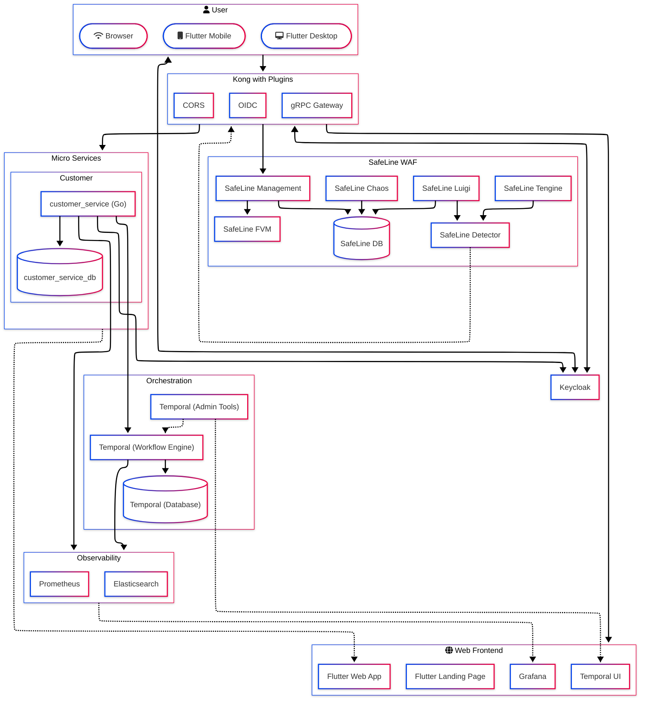

# Starter Kit SaaS B2B

This **starter kit** provides a robust, extensible, and secure foundation for developing a full-stack B2B SaaS, ready to
run locally. It includes:

- **Frontend**: Flutter (Web / Mobile / Desktop)
    - Landing Page: Built with Flutter Web, Material UI, and atomic design pattern
    - SaaS App: Built with Flutter Web, Material UI, and atomic design pattern, connected to Auth and microservices
    - Design System: Atomic design pattern with responsive and adaptive components
- **API Gateway & WAF**: Kong + SafeLine
    - Kong: API Gateway for routing, authentication, rate limiting, and request transformation
    - SafeLine: Web Application Firewall for protecting against web attacks
- **IAM**: Keycloak (OAuth2 / OIDC)
- **Orchestration**: Temporal (event-driven workflows)
    - Temporal: Workflow engine for managing long-running business processes
    - Temporal UI: Web interface for monitoring and managing workflows
- **Microservices**: Go, each with its own PostgreSQL database
    - Customer Service: Manages customer information and profiles
- **Observability**: OpenTelemetry with Prometheus, Grafana and Elasticsearch
    - Prometheus: Collects and stores metrics
    - Grafana: Visualizes metrics and logs
    - Elasticsearch: Stores and indexes logs/traces from all microservices
  
---

## Installation and Startup

```bash
docker compose -p SaaSter up -d
```

> **Note**: In a production environment, replace the development ACME certificates with trusted TLS certificates, and
> migrate to Kubernetes using your own manifests or Helm charts.

---

## Architecture Overview


```mermaid
---
config:
  theme: neo
  layout: elk
  look: neo
---
flowchart TD
    subgraph client["fa:fa-user User"]
        mobile(["fa:fa-mobile Flutter Mobile"])
        desktop(["fa:fa-desktop Flutter Desktop"])
        chrome(["fa:fa-wifi Browser"])
    end
    subgraph kong["Kong with Plugins"]
        oidc["OIDC"]
        grpc-gateway["gRPC Gateway"]
        cors["CORS"]
    end
    safeline-detector -.-> kong
    kong --> safeline-mgt
    subgraph safeline["SafeLine WAF"]
        safeline-mgt["SafeLine Management"]
        safeline-detector["SafeLine Detector"]
        safeline-tengine["SafeLine Tengine"]
        safeline-db[("SafeLine DB")]
        safeline-luigi["SafeLine Luigi"]
        safeline-fvm["SafeLine FVM"]
        safeline-chaos["SafeLine Chaos"]
        safeline-chaos & safeline-luigi & safeline-mgt --> safeline-db
        safeline-mgt --> safeline-fvm
        safeline-luigi --> safeline-detector
        safeline-tengine --> safeline-detector
    end
    subgraph front["fa:fa-globe Web Frontend"]
        web["Flutter Web App"]
        landing["Flutter Landing Page"]
        temporal["Temporal UI"]
        grafana["Grafana"]
    end
    subgraph orch["Orchestration"]
        D["Temporal (Workflow Engine)"]
        D1["Temporal (Admin Tools)"]
        D3[("Temporal (Database)")]
    end
    subgraph customer["Customer"]
        customer-service["customer_service (Go)"]
        customer-db[("customer_service_db")]
    end
    subgraph ms["Micro Services"]
        customer
    end
    subgraph obs["Observability"]
        promoteus["Prometheus"]
        elasticsearch["Elasticsearch"]
    end
    D --> D3
    D1 -.-> D
    customer-service --> customer-db & iam["Keycloak"] & D & obs
    obs -.-> grafana
    D1 -.-> temporal
    ms -.-> web
    D --> obs
    client --> kong
    kong --> front & ms
    kong <--> iam
    client <--> iam
```

All user requests pass through **Kong** (API Gateway) with **SafeLine** (Web Application Firewall) protection, which
routes to **Temporal** for orchestrating workflows (registration, authentication, etc.) without direct coupling between
microservices. **Keycloak** manages IAM, and **Linkerd** ensures mutual TLS, load balancing, and inter-service
resilience. Finally, **Prometheus**, **Grafana**, and **Elasticsearch** deliver comprehensive observability.

---

## API Gateway

The gateway architecture consists of two main components:

1. **Kong**: API Gateway for managing API access
    - TLS termination
    - Routing based on hostnames
    - Load balancing
    - Basic traffic management
    - Authentication with OAuth2 for API endpoints
    - Frontend applications access without authentication
    - Request/response transformation
    - Service aggregation
    - Protocol translation (REST to gRPC)
    - gRPC-Gateway for REST to gRPC conversion

2. **SafeLine**: Web Application Firewall (WAF) for security
    - Protection against SQL injection, XSS, and other OWASP Top 10 vulnerabilities
    - Anti-bot protection with interactive challenges
    - Rate limiting to prevent DoS attacks
    - Dynamic HTML/JS protection to prevent client-side attacks
    - Authentication challenges for restricted areas
    - Real-time traffic monitoring and attack detection
    - Customizable protection rules and policies

### Integration

SafeLine is integrated with Kong using the `kong-safeline` plugin, which is applied globally to all routes. This ensures
that all traffic passing through Kong is inspected and protected by SafeLine's security features.

The following endpoints are available:

- **API Gateway**: http://localhost
    - `/api/v1/customer` - Customer API (GET, PUT, POST)
    - `/api/v1/customers` - List Customers API (GET)
    - `/temporal/*` - Temporal UI (no authentication required)
    - `/auth/*` - Keycloak authentication (no authentication required)
    - `/grafana/*` - Grafana dashboard (no authentication required)

Access the SafeLine dashboard at: https://localhost:9443

### REST to gRPC Mapping

Kong API Gateway is configured to map REST endpoints to gRPC methods for the customer service:

| REST Endpoint       | HTTP Method | gRPC Method    |
|---------------------|-------------|----------------|
| `/api/v1/customer`  | GET         | GetCustomer    |
| `/api/v1/customer`  | PUT         | AddCustomer    |
| `/api/v1/customer`  | POST        | UpdateCustomer |
| `/api/v1/customers` | GET         | ListCustomers  |

This mapping is achieved using the gRPC-Gateway plugin in Kong, which translates between REST and gRPC protocols. The
configuration includes:

1. **Protocol Translation**: Converting REST requests to gRPC calls
2. **Authentication Propagation**: Passing OAuth2 tokens to backend services
3. **Content Type Conversion**: Handling JSON to Protocol Buffers conversion

### Using from Flutter

Example Flutter code to interact with the API Gateway:

```dart
import 'dart:convert';
import 'package:http/http.dart' as http;

class CustomerClient {
  final String baseUrl;
  final String token;
  final http.Client _httpClient = http.Client();

  CustomerClient({
    required this.token,
    this.baseUrl = 'http://localhost/api/v1',
  });

  Future<Map<String, dynamic>> getCustomer(String id) async {
    final response = await _httpClient.get(
      Uri.parse('$baseUrl/customer?id=$id'),
      headers: {
        'Content-Type': 'application/json',
        'Authorization': 'Bearer $token',
      },
    );

    if (response.statusCode != 200) {
      throw Exception('Failed to get customer: ${response.body}');
    }

    return jsonDecode(response.body);
  }

  Future<Map<String, dynamic>> addCustomer(Map<String, dynamic> customerData) async {
    final response = await _httpClient.put(
      Uri.parse('$baseUrl/customer'),
      headers: {
        'Content-Type': 'application/json',
        'Authorization': 'Bearer $token',
      },
      body: jsonEncode(customerData),
    );

    if (response.statusCode != 200) {
      throw Exception('Failed to add customer: ${response.body}');
    }

    return jsonDecode(response.body);
  }
}
```

## Web Application Firewall (SafeLine)

SafeLine is a self-hosted Web Application Firewall (WAF) that protects your web applications from attacks and exploits.
It is integrated with Kong API Gateway to provide comprehensive security for all traffic.

### Key Features

- **Block Web Attacks**: Defends against SQL injection, XSS, code injection, command injection, CRLF injection, XXE,
  SSRF, path traversal, and more.
- **Rate Limiting**: Protects against DoS attacks, brute force attempts, and traffic surges.
- **Anti-Bot Challenge**: Blocks bots while allowing human users through interactive challenges.
- **Authentication Challenge**: Can require password authentication for visitors to specific routes.
- **Dynamic Protection**: Dynamically encrypts HTML and JS code to prevent client-side attacks.

### Management Interface

SafeLine provides a web-based management interface accessible at `https://localhost:9443` with default credentials (
admin/admin). Through this interface, you can:

- View attack logs and analytics
- Configure protection rules
- Set up rate limiting policies
- Enable/disable specific security features
- Monitor traffic and security events

For detailed configuration options, see the [SafeLine WAF documentation](./infra/safeline/README.md).

## Best Practices Employed

- **Database-per-Service**: each microservice owns its own PostgreSQL database, isolating functional domains.
- **Event-Driven Orchestration**: Temporal guarantees atomicity and failure recovery for business workflows.
  See [Temporal Configuration Guide](./doc/temporal_configuration.md) for details on configuring Temporal for new
  microservices.
- **Zero-Trust & mTLS**: Linkerd's service mesh enforces mutual authentication and encrypts internal communications.
- **Security "By Design"**: Advanced WAF protection via SafeLine, rate limiting, OAuth2 authentication for APIs,
  separate authentication for frontend applications, token propagation, and TLS certificates.
- **Resilience Patterns**: retries, circuit breakers, health checks, bulkheads, and horizontal scalability.
- **12-Factor App**: configuration via environment variables, logging to stdout, stateless services, etc.
- **Observability**: centralized metrics and logs for rapid diagnostics.

---

## Accessible Websites

Once the Kong API Gateway is running, the following web interfaces/applications become available:

| Website      | URL                         | Description                                                                            | Authentication                     |
|--------------|-----------------------------|----------------------------------------------------------------------------------------|------------------------------------|
| Landing Page | http://localhost/           | Main website with marketing content and call-to-action elements                        | No authentication required         |
| SaaS App     | http://localhost/app        | Main SaaS application with user authentication and authorization                       | Uses its own authentication system |
| Widgetbook   | http://localhost/widgetbook | Interactive documentation and testing for design system components                     | No authentication required         |
| Keycloak     | http://localhost/auth       | Identity and Access Management (IAM) service for user authentication and authorization | Uses its own authentication system |
| Temporal UI  | http://localhost/temporal   | Web interface for monitoring and managing Temporal workflows                           | Uses its own authentication system |
| Grafana      | http://localhost/grafana    | Dashboard for metrics visualization and monitoring                                     | Uses its own authentication system |
| SafeLine UI  | https://localhost/safeline  | Web Application Firewall management interface                                          | admin/admin (default)              |
| Kong Admin   | http://localhost/kong-admin | API Gateway administration interface                                                   | No authentication required         |

### API Endpoints

The following API endpoints are available through the Kong API Gateway:

| API Endpoint      | HTTP Method | Description                   | Authentication  |
|-------------------|-------------|-------------------------------|-----------------|
| /api/v1/customer  | GET         | Retrieve customer information | OAuth2 required |
| /api/v1/customer  | PUT         | Add a new customer            | OAuth2 required |
| /api/v1/customer  | POST        | Update customer information   | OAuth2 required |
| /api/v1/customers | GET         | List all customers            | OAuth2 required |

## Documentation Summary

This project contains extensive documentation across various components. Below is a comprehensive summary of all
available documentation:

### Backend

- [Backend Overview](./backend/README.md) - Overview of the backend architecture, including microservices, hexagonal
  architecture, and CQRS pattern.
    - [Customer Service](./backend/customer_service/README.md) - Documentation for the customer service microservice,
      including API endpoints, Temporal workflows, and architecture.

### Frontend

- [Frontend Overview](./frontend/README.md) - Documentation for the Flutter applications, including web, mobile, and
  desktop clients.
- [Design System](./frontend/design_system/README.md) - Comprehensive Flutter design system using Material UI and atomic
  design pattern with responsive components.
    - [Widgetbook](./frontend/design_system/widgetbook/README.md) - Interactive showcase and documentation of design
      system components using Widgetbook.
- [Website](./frontend/website/README.md) - Documentation for the Flutter-based marketing website and landing pages.

### Infrastructure

- [Infrastructure Overview](./infra/README.md) - Overview of the infrastructure components, including Docker Compose
  configuration.
- [Keycloak](./infra/keycloak/README.md) - Documentation for Keycloak configuration, including realms, clients, and
  users.
- [Kong API Gateway](./infra/kong/README.md) - Detailed guide for Kong API Gateway, including configuration, routes, and
  plugins.
- [SafeLine WAF](./infra/safeline/README.md) - Guide for SafeLine Web Application Firewall configuration and usage.
- [Temporal](./infra/temporal/README.md) - Comprehensive documentation for Temporal workflow engine, including
  configuration, workflows, and activities.
  - [Temporal Dynamic Config](./infra/temporal/dynamicconfig/README.md) - Guide for configuring Temporal's dynamic
    configuration settings for different namespaces and task queues.

## License

This project is released under the **MIT** license. See the [`LICENSE`](./LICENSE) file for more details.
