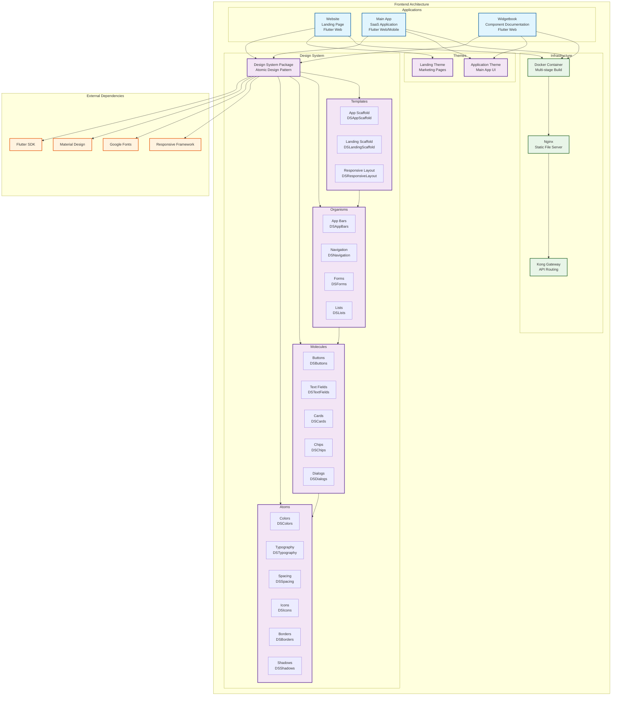

# SaaSter Kit Frontend

A comprehensive Flutter-based frontend system for the SaaSter Kit B2B SaaS platform, featuring three applications built with atomic design principles and a shared design system.

## Overview

The SaaSter Kit frontend provides a complete user interface solution for B2B SaaS applications, consisting of:

- **Website**: Marketing landing page built with Flutter Web
- **Main App**: Core SaaS application supporting web and mobile platforms
- **Widgetbook**: Interactive component documentation and testing environment
- **Design System**: Shared UI components following atomic design methodology

All applications are containerized using Docker and served through the Kong API Gateway with SafeLine WAF protection.

## Key Features

- **Cross-Platform Support**: Flutter applications work on web, mobile, and desktop
- **Atomic Design Pattern**: Components organized as atoms, molecules, organisms, and templates
- **Responsive Design**: Adaptive layouts for all screen sizes and devices
- **Material Design**: Built on Flutter's Material UI with custom theming
- **Component Documentation**: Interactive Widgetbook for design system exploration
- **Production Ready**: Docker containerization with Nginx serving
- **API Integration**: Pre-configured client for backend microservices

## Architecture

The frontend follows a modular architecture with clear separation of concerns:



### Component Hierarchy

The design system follows atomic design principles:

1. **Atoms**: Basic building blocks (colors, typography, spacing, icons, borders, shadows)
2. **Molecules**: Simple UI components combining atoms (buttons, text fields, cards, chips, dialogs)
3. **Organisms**: Complex components combining molecules (app bars, navigation, forms, lists)
4. **Templates**: Page-level layouts and patterns (scaffolds, responsive layouts)

### Applications

#### Website (`frontend/website/`)
- **Purpose**: Marketing landing page and company website
- **Technology**: Flutter Web
- **Theme**: Landing theme optimized for marketing content
- **Features**: Responsive design, SEO optimization, call-to-action elements
- **Access**: `http://localhost/` (via Kong Gateway)

#### Main App (`frontend/main_app/`)
- **Purpose**: Core SaaS application for end users
- **Technology**: Flutter Web and Mobile
- **Theme**: Application theme optimized for productivity
- **Features**: Authentication, dashboard, user management, API integration
- **Access**: `http://localhost/app` (via Kong Gateway)

#### Widgetbook (`frontend/design_system/widgetbook/`)
- **Purpose**: Interactive component documentation and testing
- **Technology**: Flutter Web with Widgetbook framework
- **Features**: Component showcase, theme switching, responsive testing
- **Access**: `http://localhost/widgetbook` (via Kong Gateway)

## Docker Configuration

The frontend uses a multi-stage Dockerfile for efficient builds and production deployment:

### Dockerfile Structure

```dockerfile
# Build stage - Install Flutter and build application
FROM debian:latest AS build
ARG FLUTTER_SDK=/usr/local/flutter
ARG FLUTTER_VERSION=stable
ARG FOLDER=website          # Application folder to build
ARG BASE_HREF=/            # Base URL path for the application

# Install dependencies and Flutter SDK
RUN apt-get update && apt-get install -y curl git unzip
RUN git clone -b $FLUTTER_VERSION https://github.com/flutter/flutter.git $FLUTTER_SDK
ENV PATH="$FLUTTER_SDK/bin:$FLUTTER_SDK/bin/cache/dart-sdk/bin:${PATH}"

# Build Flutter application
WORKDIR $APP/$FOLDER
RUN flutter clean && flutter pub get
RUN flutter build web -t lib/main.dart --release --base-href $BASE_HREF

# Production stage - Serve with Nginx
FROM nginx:stable-alpine-slim AS release
COPY --from=build /app/build/web /usr/share/nginx/html
COPY nginx.conf /etc/nginx/nginx.conf
EXPOSE 80
CMD ["nginx", "-g", "daemon off;"]
```

### Build Arguments

- **FOLDER**: Specifies which application to build (`website`, `main_app`, or `design_system/widgetbook`)
- **BASE_HREF**: Sets the base URL path for the application routing

### Docker Compose Configuration

Each frontend application is configured in `docker-compose.yml`:

```yaml
# Website
website:
  build:
    context: ./frontend
    dockerfile: Dockerfile
    args:
      - FOLDER=website
      - BASE_HREF=/

# Main App
webapp:
  build:
    context: ./frontend
    dockerfile: Dockerfile
    args:
      - FOLDER=main_app
      - BASE_HREF=/app/

# Widgetbook
widgetbook:
  build:
    context: ./frontend
    dockerfile: Dockerfile
    args:
      - FOLDER=design_system/widgetbook
      - BASE_HREF=/widgetbook/
```

## Production Deployment with Helm

For production deployment on Kubernetes, the Docker images can be used with Helm charts:

### Basic Helm Chart Structure

```yaml
# values.yaml
frontend:
  website:
    image: your-registry/saaster-website:latest
    replicas: 2
    service:
      port: 80
    ingress:
      enabled: true
      host: your-domain.com
      path: /
  
  webapp:
    image: your-registry/saaster-webapp:latest
    replicas: 3
    service:
      port: 80
    ingress:
      enabled: true
      host: your-domain.com
      path: /app
  
  widgetbook:
    image: your-registry/saaster-widgetbook:latest
    replicas: 1
    service:
      port: 80
    ingress:
      enabled: true
      host: your-domain.com
      path: /widgetbook
```

### Deployment Commands

```bash
# Build and push images
docker build -t your-registry/saaster-website:latest \
  --build-arg FOLDER=website \
  --build-arg BASE_HREF=/ \
  ./frontend

docker build -t your-registry/saaster-webapp:latest \
  --build-arg FOLDER=main_app \
  --build-arg BASE_HREF=/app/ \
  ./frontend

docker build -t your-registry/saaster-widgetbook:latest \
  --build-arg FOLDER=design_system/widgetbook \
  --build-arg BASE_HREF=/widgetbook/ \
  ./frontend

# Deploy with Helm
helm install saaster-frontend ./helm-chart \
  --values values.yaml \
  --namespace saaster-frontend \
  --create-namespace
```

### Production Considerations

- Replace development certificates with trusted TLS certificates
- Configure proper ingress controllers and load balancers
- Set up monitoring and logging for frontend applications
- Implement proper backup and disaster recovery procedures
- Configure auto-scaling based on traffic patterns

## AI-Assisted Development

The SaaSter Kit frontend is designed to work seamlessly with AI-assisted development tools. Here are comprehensive examples and best practices:

### General Workflow

1. **Planning Phase**: Analyze existing codebase structure and atomic design patterns
2. **Implementation Phase**: Follow design system conventions and responsive design principles
3. **Documentation Phase**: Add components to Widgetbook and update exports
4. **Integration Phase**: Test across applications and verify responsive behavior

### Example 1: Add Internationalization (i18n) to Main App

**Prompt:**
```
Add internationalization (i18n) support to the main Flutter app. Include:
- Support for English and French languages
- Localized strings for common UI elements (login, signup, dashboard, etc.)
- Date and number formatting
- RTL support preparation
- Integration with the existing design system
```

**Implementation Steps:**
1. Add flutter_localizations and intl dependencies to `pubspec.yaml`
2. Create `l10n.yaml` configuration file
3. Create ARB files for English (`app_en.arb`) and French (`app_fr.arb`)
4. Update MaterialApp to use generated localizations
5. Replace hardcoded strings with localized versions using `context.l10n`
6. Update design system components to support localization

**Expected Files Modified:**
- `frontend/main_app/pubspec.yaml` - Add dependencies
- `frontend/main_app/l10n.yaml` - Localization configuration
- `frontend/main_app/lib/l10n/app_en.arb` - English strings
- `frontend/main_app/lib/l10n/app_fr.arb` - French strings
- `frontend/main_app/lib/main.dart` - Configure MaterialApp
- Various UI files to replace hardcoded strings

### Example 2: Add CandlestickChart Component to Design System

**Prompt:**
```
Create a new CandlestickChart component in the design system using fl_chart package. The component should:
- Display financial candlestick data with OHLC values
- Support both light and dark themes
- Include customizable colors for bullish/bearish candles
- Add touch interactions for data point details
- Follow atomic design pattern as a molecule component
- Include responsive design for different screen sizes
- Add to Widgetbook for documentation and testing
```

**Implementation Steps:**
1. Verify fl_chart dependency in design_system `pubspec.yaml`
2. Create CandlestickChart widget in molecules directory
3. Define data models for OHLC (Open, High, Low, Close) values
4. Implement chart styling that matches design system themes
5. Add touch interaction handlers for data point selection
6. Create responsive wrapper for different screen sizes
7. Add component to Widgetbook with various use cases
8. Update design system exports

**Expected Files Modified:**
- `frontend/design_system/lib/src/molecules/charts/candlestick_chart.dart` - New component
- `frontend/design_system/lib/src/molecules/charts/models/ohlc_data.dart` - Data model
- `frontend/design_system/lib/src/molecules/molecules.dart` - Export new component
- `frontend/design_system/widgetbook/lib/use_cases/molecules/charts/candlestick_chart_use_case.dart` - Widgetbook showcase

### Example 3: Implement Footer Links in Website

**Prompt:**
```
Add a comprehensive footer to the marketing website with:
- Company information and logo
- Navigation links (About, Features, Pricing, Contact)
- Social media links (Twitter, LinkedIn, GitHub)
- Legal links (Privacy Policy, Terms of Service)
- Newsletter signup form
- Responsive design that works on mobile and desktop
- Integration with landing theme from design system
- Proper accessibility attributes
```

**Implementation Steps:**
1. Create Footer organism component in design system
2. Design responsive layout using `DSResponsiveLayout`
3. Add social media icons to `DSIcons` if not present
4. Create newsletter signup form using existing form molecules
5. Style footer using landing theme colors and typography
6. Add footer to website's main layout
7. Update Widgetbook with footer showcase
8. Ensure proper semantic HTML and accessibility

**Expected Files Modified:**
- `frontend/design_system/lib/src/organisms/footer/website_footer.dart` - New footer component
- `frontend/design_system/lib/src/atoms/icons/ds_icons.dart` - Add social media icons
- `frontend/design_system/lib/src/organisms/organisms.dart` - Export footer
- `frontend/website/lib/pages/home/home_page.dart` - Add footer to layout
- `frontend/design_system/widgetbook/lib/use_cases/organisms/footer/website_footer_use_case.dart` - Widgetbook showcase

### Best Practices for AI-Assisted Development

1. **Be Specific**: Provide detailed requirements including design, functionality, and integration needs
2. **Reference Existing Patterns**: Mention similar components or patterns already in the codebase
3. **Include Context**: Specify which application (website, main_app, widgetbook) and design system layer
4. **Request Testing**: Ask for Widgetbook integration and responsive testing
5. **Consider Themes**: Ensure components work with both application and landing themes
6. **Plan for Accessibility**: Include accessibility requirements in prompts
7. **Follow Atomic Design**: Specify whether creating atoms, molecules, organisms, or templates

### Code Examples

#### Using Design System Components

```dart
import 'package:design_system/design_system.dart';

// Responsive layout
DSResponsiveLayout.responsiveBuilder(
  context: context,
  mobile: MobileView(),
  tablet: TabletView(),
  desktop: DesktopView(),
)

// Themed button
DSButtons.primaryAppButton(
  text: 'Submit',
  onPressed: () {},
)

// API integration
class CustomerClient {
  final String baseUrl;
  final String token;
  
  CustomerClient({
    required this.token,
    this.baseUrl = 'http://localhost/api/v1',
  });
  
  Future<Map<String, dynamic>> getCustomer(String id) async {
    final response = await http.get(
      Uri.parse('$baseUrl/customer?id=$id'),
      headers: {
        'Content-Type': 'application/json',
        'Authorization': 'Bearer $token',
      },
    );
    return jsonDecode(response.body);
  }
}
```

## Getting Started

### Prerequisites

- Flutter SDK (stable channel)
- Docker and Docker Compose
- Git

### Local Development

1. **Clone the repository:**
   ```bash
   git clone https://github.com/your-org/saaster_kit.git
   cd saaster_kit
   ```

2. **Start the complete system:**
   ```bash
   docker compose -p SaaSter up -d
   ```

3. **Access the applications:**
   - Website: http://localhost/
   - Main App: http://localhost/app
   - Widgetbook: http://localhost/widgetbook

### Development Workflow

1. **Design System Development:**
   ```bash
   cd frontend/design_system
   flutter pub get
   flutter run -d chrome  # For Widgetbook
   ```

2. **Application Development:**
   ```bash
   cd frontend/main_app  # or frontend/website
   flutter pub get
   flutter run -d chrome
   ```

3. **Building for Production:**
   ```bash
   docker build -t saaster-frontend \
     --build-arg FOLDER=main_app \
     --build-arg BASE_HREF=/app/ \
     ./frontend
   ```

## Project Structure

```
frontend/
├── README.md                    # This documentation
├── Dockerfile                   # Multi-stage build configuration
├── nginx.conf                   # Nginx configuration for production
├── design_system/               # Shared UI components
│   ├── lib/src/
│   │   ├── atoms/              # Basic building blocks
│   │   ├── molecules/          # Simple components
│   │   ├── organisms/          # Complex components
│   │   └── templates/          # Layout patterns
│   └── widgetbook/             # Component documentation
├── main_app/                   # Core SaaS application
│   ├── lib/
│   │   ├── pages/              # Application screens
│   │   ├── widgets/            # App-specific widgets
│   │   └── services/           # API clients and services
│   └── pubspec.yaml
└── website/                    # Marketing landing page
    ├── lib/
    │   ├── pages/              # Website pages
    │   └── widgets/            # Website-specific widgets
    └── pubspec.yaml
```

## Contributing

When contributing to the frontend:

1. Follow the atomic design pattern for new components
2. Add new components to the appropriate Widgetbook category
3. Ensure responsive design across all screen sizes
4. Test with both application and landing themes
5. Update documentation and exports
6. Follow Flutter and Dart best practices

For detailed contribution guidelines, see the main project README.
