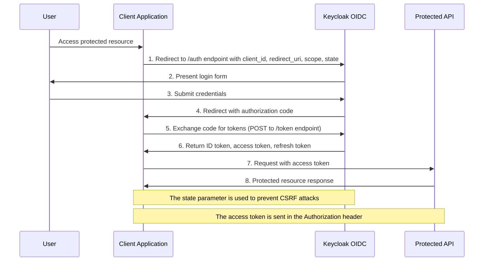
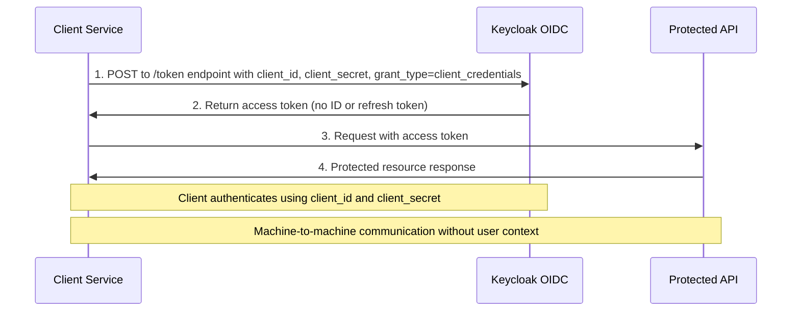

# Keycloak Identity and Access Management

This document explains how Keycloak works as an OpenID Connect (OIDC) server, details the authentication flows, and provides guidance on configuring the realm.json file for your security requirements.

## OpenID Connect (OIDC) Server

OpenID Connect is an identity layer built on top of the OAuth 2.0 protocol. While OAuth 2.0 is designed for authorization (granting access to resources), OIDC adds authentication (verifying identity) capabilities.

### Key Components

1. **Identity Provider (IdP)**: Keycloak serves as the IdP, authenticating users and providing identity information.

2. **Relying Party (RP)**: Your applications that rely on Keycloak for authentication.

3. **End User**: The person authenticating through Keycloak.

4. **ID Token**: A JWT (JSON Web Token) containing claims about the authentication event and user identity.

5. **Access Token**: A JWT granting access to protected resources.

6. **Refresh Token**: A token used to obtain new access tokens without re-authentication.

### Endpoints

Keycloak exposes several OIDC endpoints:

- **Authorization Endpoint**: `/auth/realms/{realm-name}/protocol/openid-connect/auth`
  Used to authenticate users and obtain authorization.

- **Token Endpoint**: `/auth/realms/{realm-name}/protocol/openid-connect/token`
  Used to exchange authorization codes for tokens or refresh existing tokens.

- **UserInfo Endpoint**: `/auth/realms/{realm-name}/protocol/openid-connect/userinfo`
  Returns claims about the authenticated user.

- **Logout Endpoint**: `/auth/realms/{realm-name}/protocol/openid-connect/logout`
  Ends the user's session.

- **Discovery Document**: `/auth/realms/{realm-name}/.well-known/openid-configuration`
  Provides metadata about the OIDC provider configuration.

## Authorization Code Flow

The Authorization Code Flow is the most common and secure flow for web applications. It involves the client application redirecting the user to Keycloak for authentication, then receiving an authorization code which is exchanged for tokens.



### Flow Details

1. **Authorization Request**: The client redirects the user to Keycloak with parameters:
   - `client_id`: The client's identifier
   - `redirect_uri`: Where to send the authorization code
   - `response_type=code`: Indicates the authorization code flow
   - `scope=openid`: Requests OIDC authentication
   - `state`: Random value to prevent CSRF attacks

2. **Authentication**: Keycloak authenticates the user (login form, SSO, etc.)

3. **Authorization Response**: Keycloak redirects back to the client with:
   - `code`: The authorization code
   - `state`: The same state value sent in the request

4. **Token Request**: The client exchanges the code for tokens by sending:
   - `grant_type=authorization_code`
   - `code`: The authorization code
   - `redirect_uri`: Must match the original request
   - `client_id` and `client_secret` (or client authentication)

5. **Token Response**: Keycloak returns:
   - `id_token`: Contains user identity information
   - `access_token`: For accessing protected resources
   - `refresh_token`: For obtaining new tokens
   - `token_type`: Usually "Bearer"
   - `expires_in`: Token lifetime in seconds

## Client Credentials Flow

The Client Credentials Flow is used for server-to-server authentication where a user context is not required. The client authenticates directly with Keycloak to obtain an access token.



### Flow Details

1. **Token Request**: The client sends a request to the token endpoint with:
   - `grant_type=client_credentials`
   - Client authentication (client_id and client_secret)
   - Optional `scope` parameter

2. **Token Response**: Keycloak returns:
   - `access_token`: For accessing protected resources
   - `token_type`: Usually "Bearer"
   - `expires_in`: Token lifetime in seconds
   - No ID token or refresh token is issued

## Configuring realm.json

The `imports/realm.json` file contains the complete configuration for your Keycloak realm. Here's how to modify it for common scenarios:

### General Structure

The realm.json file has the following main sections:

```json
{
  "id": "realm-id",
  "realm": "realm-name",
  "enabled": true,
  "users": [...],
  "roles": {...},
  "groups": [...],
  "clients": [...],
  "clientScopes": [...],
  "authenticationFlows": [...]
}
```

### Adding a New Client for Client Credentials Flow

To add a new client for machine-to-machine authentication:

```json
{
  "clientId": "my-service-client",
  "name": "My Service Client",
  "enabled": true,
  "clientAuthenticatorType": "client-secret",
  "secret": "my-secret-value",
  "redirectUris": [],
  "webOrigins": [],
  "standardFlowEnabled": false,
  "implicitFlowEnabled": false,
  "directAccessGrantsEnabled": false,
  "serviceAccountsEnabled": true,
  "authorizationServicesEnabled": false,
  "publicClient": false,
  "protocol": "openid-connect"
}
```

Add this object to the `clients` array in realm.json. Key settings:
- `serviceAccountsEnabled: true` enables the client credentials flow
- `standardFlowEnabled: false` disables the authorization code flow
- `publicClient: false` indicates this client has a secret

### Adding a New Client for Authorization Code Flow

For web applications using the authorization code flow:

```json
{
  "clientId": "my-web-app",
  "name": "My Web Application",
  "enabled": true,
  "clientAuthenticatorType": "client-secret",
  "secret": "my-web-app-secret",
  "redirectUris": ["https://myapp.example.com/callback"],
  "webOrigins": ["https://myapp.example.com"],
  "standardFlowEnabled": true,
  "implicitFlowEnabled": false,
  "directAccessGrantsEnabled": false,
  "serviceAccountsEnabled": false,
  "authorizationServicesEnabled": false,
  "publicClient": false,
  "protocol": "openid-connect"
}
```

Key settings:
- `standardFlowEnabled: true` enables the authorization code flow
- `redirectUris` must include all valid callback URLs
- `webOrigins` controls CORS access

### Adding Users

To add a new user to the realm:

```json
{
  "username": "john.doe",
  "enabled": true,
  "firstName": "John",
  "lastName": "Doe",
  "email": "john.doe@example.com",
  "credentials": [
    {
      "type": "password",
      "value": "initial-password",
      "temporary": true
    }
  ],
  "requiredActions": ["UPDATE_PASSWORD"],
  "realmRoles": ["user"],
  "clientRoles": {
    "my-web-app": ["app-user"]
  },
  "groups": ["employees"]
}
```

Add this object to the `users` array. The `requiredActions` field forces the user to update their password on first login.

### Adding Groups

To add a new group:

```json
{
  "name": "employees",
  "path": "/employees",
  "attributes": {
    "department": ["engineering"]
  },
  "realmRoles": ["user"],
  "clientRoles": {
    "my-web-app": ["app-user"]
  },
  "subGroups": []
}
```

Add this object to the `groups` array. Users in this group will inherit the assigned roles.

### Adding Roles

To add realm roles:

```json
"roles": {
  "realm": [
    {
      "name": "admin",
      "description": "Administrator role"
    },
    {
      "name": "user",
      "description": "Regular user role"
    }
  ],
  "client": {
    "my-web-app": [
      {
        "name": "app-admin",
        "description": "Application administrator"
      },
      {
        "name": "app-user",
        "description": "Application user"
      }
    ]
  }
}
```

### Configuring Authentication Policies

To modify password policies:

```json
"passwordPolicy": "length(8) and upperCase(1) and lowerCase(1) and specialChars(1) and digits(1) and notUsername()"
```

Add this at the realm level to enforce password complexity requirements.

### Setting Token Lifespans

To configure token lifespans:

```json
"accessTokenLifespan": 300,
"refreshTokenLifespan": 1800,
"ssoSessionIdleTimeout": 1800,
"ssoSessionMaxLifespan": 36000
```

Add these at the realm level. Values are in seconds:
- `accessTokenLifespan`: 5 minutes
- `refreshTokenLifespan`: 30 minutes
- `ssoSessionIdleTimeout`: 30 minutes of inactivity before session expires
- `ssoSessionMaxLifespan`: 10 hours maximum session lifetime

## Best Practices

1. **Use Client Secrets**: Generate strong, random client secrets for confidential clients.

2. **Limit Redirect URIs**: Only include necessary and validated redirect URIs.

3. **Scope Management**: Define and use appropriate scopes to limit token permissions.

4. **Token Lifespans**: Set appropriate token lifespans based on security requirements.

5. **Role-Based Access Control**: Use roles and groups to manage permissions effectively.

6. **Regular Audits**: Periodically review clients, users, and roles for unnecessary access.

7. **Secure Client Storage**: Store client secrets securely using environment variables or secrets management.
