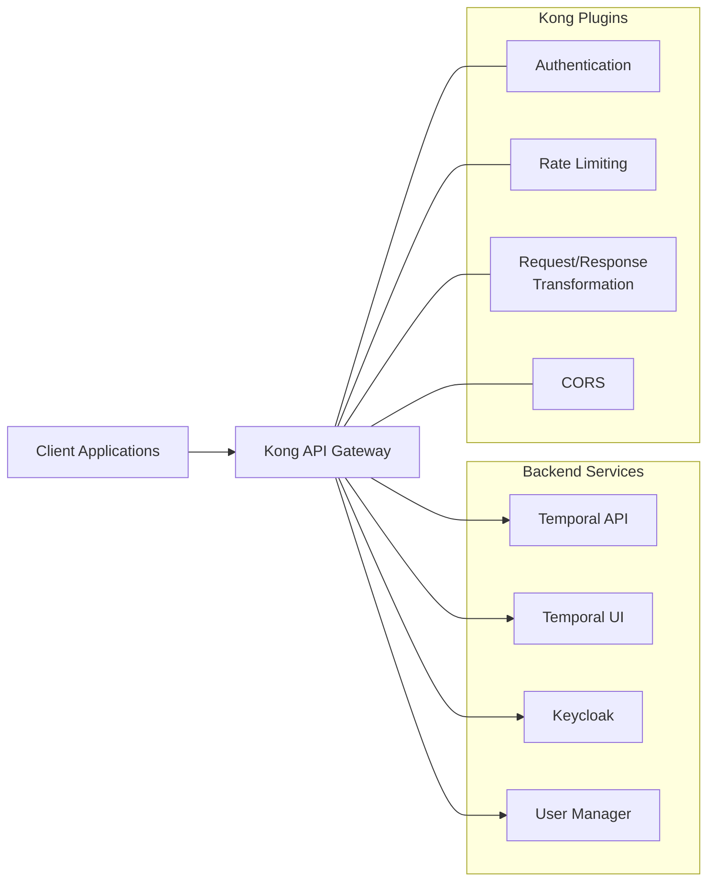
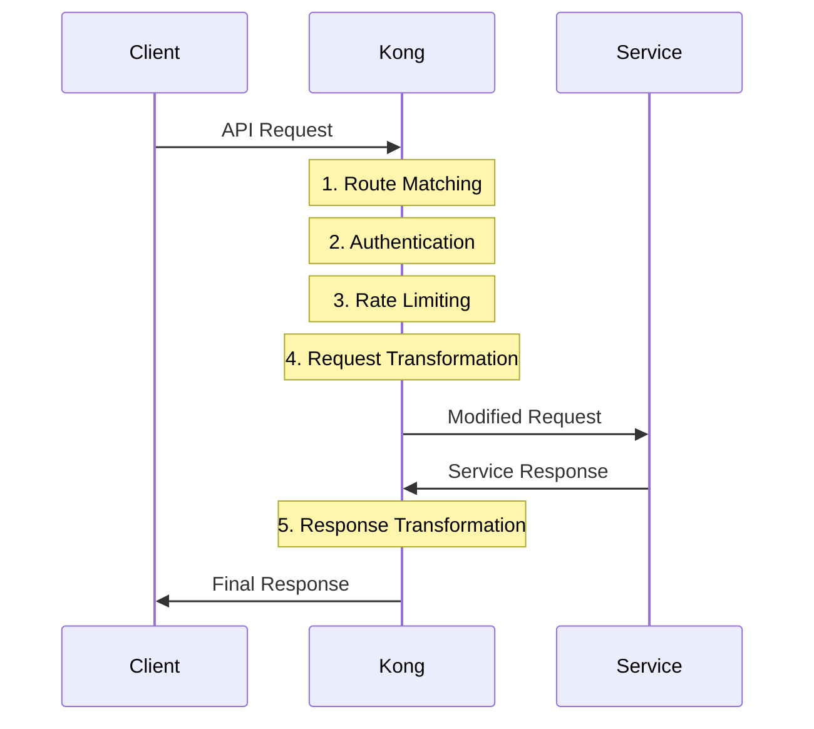

# Kong API Gateway

## How Kong Works

Kong is a cloud-native, platform-agnostic API gateway that sits between clients and your services, acting as a reverse proxy, authentication layer, and microservices orchestrator. It's built on top of NGINX and provides a robust set of features for managing API traffic.

### Core Architecture



### Key Concepts

1. **Services**: Represent your upstream APIs or microservices that Kong proxies to.

2. **Routes**: Define how requests are sent to Services based on paths, hosts, methods, etc.

3. **Consumers**: Represent users or applications that consume your APIs.

4. **Plugins**: Add functionality to Services, Routes, or globally across all traffic.

5. **Upstreams**: Define load balancing properties for Services with multiple targets.

### Request Flow



## Understanding kong.yml Configuration

The `kong.yml` file uses Kong's declarative configuration format (DB-less mode) to define all aspects of the API gateway. Here's a breakdown of its structure:

### Format Version

```yaml
_format_version: "3.0"
```
Specifies the version of Kong's declarative configuration format being used.

### Services and Routes

Services define upstream APIs, while routes determine how requests are matched to services.

```yaml
services:
  - name: service-name
    url: http://upstream-service:port
    routes:
      - name: route-name
        paths:
          - /path-pattern
        strip_path: true|false
```

- **name**: Unique identifier for the service
- **url**: The upstream service location
- **routes**: Array of route objects that point to this service
  - **paths**: URL paths that match this route
  - **strip_path**: Whether to remove the matched path prefix when forwarding

### Plugins

Plugins add functionality to services or routes:

```yaml
plugins:
  - name: plugin-name
    config:
      key1: value1
      key2: value2
```

Common plugins in our configuration:

- **key-auth**: API key authentication
- **cors**: Cross-Origin Resource Sharing settings
- **rate-limiting**: Controls request rates
- **request-transformer**: Modifies requests before forwarding

### Consumers and Credentials

Consumers represent API clients with authentication credentials:

```yaml
consumers:
  - username: consumer-name
    keyauth_credentials:
      - key: api-key-value
```

## Current Configuration

Our `kong.yml` defines three main services:

1. **temporal-api**: Proxies requests to the Temporal server API
   - Routes: `/api/v1/workflows` and `/api/v1/namespaces`
   - Protected by API key authentication
   - Includes CORS, rate limiting, and request transformation

2. **temporal-ui**: Proxies requests to the Temporal web UI
   - Route: `/temporal`
   - Includes CORS configuration

3. **keycloak-service**: Proxies requests to Keycloak authentication service
   - Route: `/auth`
   - Includes CORS configuration

It also defines a consumer `flutter-app` with an API key for authentication.

## Adding New Routes for Temporal Workflows

To map a standard REST API endpoint to a Temporal workflow, we need to:

1. Create a new route that matches the API endpoint pattern
2. Use request transformation to convert the API request to a Temporal workflow request

### Example: Mapping GET /api/v1/users/:id to a Temporal Workflow

Here's how to add a new route to map `GET /api/v1/users/:id` to the `GetUser` workflow in the `user-manager` namespace:

```yaml
services:
  # Add this to the existing services list
  - name: user-api
    url: http://temporal:7233
    routes:
      - name: get-user
        paths:
          - /api/v1/users/
        strip_path: false
        methods:
          - GET
    plugins:
      - name: key-auth
        config:
          key_names:
            - apikey
          hide_credentials: true
      - name: cors
        config:
          origins:
            - "*"
          methods:
            - GET
            - OPTIONS
          headers:
            - Authorization
            - Content-Type
            - Accept
          credentials: true
          max_age: 3600
      - name: request-transformer
        config:
          http_method: POST
          add:
            headers:
              - "Content-Type: application/json"
          replace:
            uri: "/api/v1/workflows"
          body_format: json
          templates:
            - content_type: application/json
              body: |
                {
                  "workflow_type": "GetUser",
                  "task_queue": "user-manager-task-queue",
                  "namespace": "user-manager",
                  "workflow_id": "get-user-$(uri_captures.id)",
                  "input": {
                    "userId": "$(uri_captures.id)"
                  }
                }
      - name: response-transformer
        config:
          add:
            headers:
              - "Content-Type: application/json"
```

### Step-by-Step Explanation

1. **Create a Service**: Define a new service `user-api` that points to the Temporal server.

2. **Define a Route**: Create a route that matches `/api/v1/users/` and only accepts GET requests.

3. **Add Authentication**: Apply the `key-auth` plugin to require API key authentication.

4. **Configure CORS**: Set up CORS headers for cross-origin requests.

5. **Transform the Request**: Use the `request-transformer` plugin to:
   - Change the HTTP method from GET to POST
   - Replace the URI with `/api/v1/workflows` (Temporal's workflow start endpoint)
   - Create a JSON body that includes:
     - The workflow type (`GetUser`)
     - The task queue (`user-manager-task-queue`)
     - The namespace (`user-manager`)
     - A unique workflow ID
     - Input parameters extracted from the original request

6. **Transform the Response**: Use the `response-transformer` plugin to ensure proper content type headers.

### Capturing URL Parameters

To capture URL parameters like the user ID, use a route pattern with a named capture:

```yaml
routes:
  - name: get-user
    paths:
      - /api/v1/users/(?<id>[\w-]+)$
```

This captures the ID portion of the URL into a variable named `id`, which can be referenced in the request transformer as `$(uri_captures.id)`.

### Handling Query Parameters

For query parameters, use the `$(query_params.param_name)` syntax in your templates:

```yaml
templates:
  - content_type: application/json
    body: |
      {
        "workflow_type": "SearchUsers",
        "input": {
          "query": "$(query_params.q)",
          "limit": "$(query_params.limit)"
        }
      }
```

## Complete Example: User Management API

Here's a more complete example that maps several user management endpoints to Temporal workflows:

```yaml
services:
  - name: user-management-api
    url: http://temporal:7233
    routes:
      # Get user by ID
      - name: get-user
        paths:
          - /api/v1/users/(?<id>[\w-]+)$
        methods:
          - GET
        strip_path: false
      # Create new user
      - name: create-user
        paths:
          - /api/v1/users$
        methods:
          - POST
        strip_path: false
      # Update user
      - name: update-user
        paths:
          - /api/v1/users/(?<id>[\w-]+)$
        methods:
          - PUT
        strip_path: false
      # Delete user
      - name: delete-user
        paths:
          - /api/v1/users/(?<id>[\w-]+)$
        methods:
          - DELETE
        strip_path: false
    plugins:
      - name: key-auth
      - name: cors
      - name: request-transformer
        config:
          http_method: POST
          replace:
            uri: "/api/v1/workflows"
          templates:
            - content_type: application/json
              body: |
                {
                  "namespace": "user-manager",
                  "task_queue": "user-manager-task-queue",
                  "workflow_id": "$(route.name)-$(uuid)",
                  "workflow_type": "{{ if eq (route.name) \"get-user\" }}GetUser{{ else if eq (route.name) \"create-user\" }}CreateUser{{ else if eq (route.name) \"update-user\" }}UpdateUser{{ else if eq (route.name) \"delete-user\" }}DeleteUser{{ end }}",
                  "input": {{ if eq (route.name) \"get-user\" }}{
                    "userId": "$(uri_captures.id)"
                  }{{ else if eq (route.name) \"create-user\" }}$(body){{ else if eq (route.name) \"update-user\" }}{
                    "userId": "$(uri_captures.id)",
                    "userData": $(body)
                  }{{ else if eq (route.name) \"delete-user\" }}{
                    "userId": "$(uri_captures.id)"
                  }{{ end }}
                }
```

This example uses conditional templating to handle different API endpoints with a single transformer configuration.

## Applying Changes

After updating the `kong.yml` file, restart Kong to apply the changes:

```bash
docker compose -p saaster restart kong
```

## Testing the API

Test your new API endpoint with curl:

```bash
curl -X GET "http://localhost:8000/api/v1/users/123" \
  -H "apikey: flutter-app-api-key"
```

This will start a Temporal workflow to get user information and return the result.
