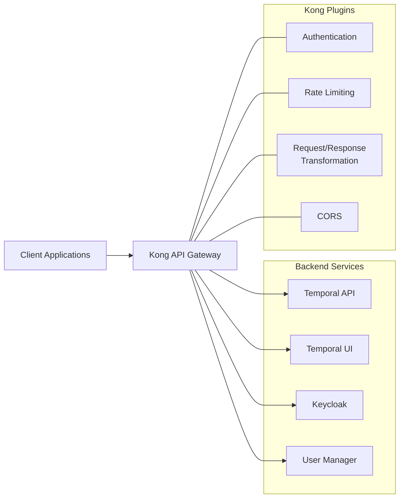
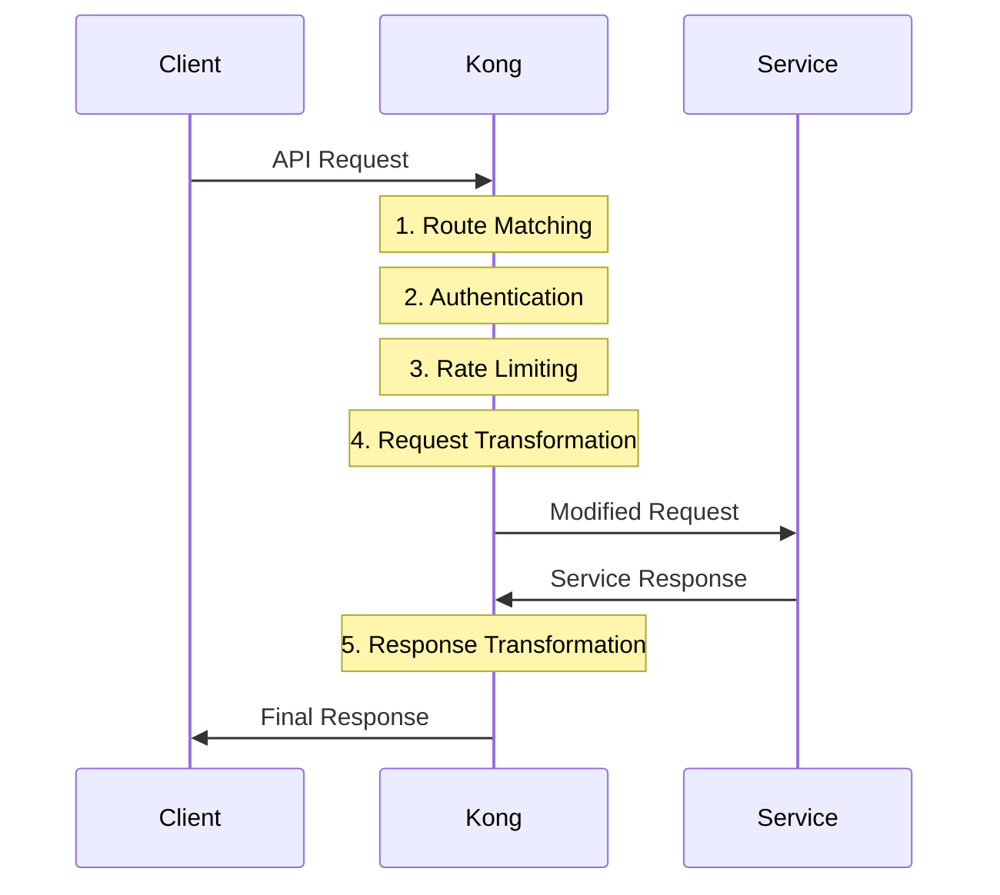

# Kong API Gateway

## How Kong Works

Kong is a cloud-native, platform-agnostic API gateway that sits between clients and your services, acting as a reverse proxy, authentication layer, and microservices orchestrator. It's built on top of NGINX and provides a robust set of features for managing API traffic.

### Core Architecture


```mermaid
flowchart LR
    Client["Client Applications"] --> Kong["Kong API Gateway"]

    subgraph Backend["Backend Services"]
        Service1["Temporal API"]
        Service2["Temporal UI"]
        Service3["Keycloak"]
        Service4["User Manager"]
    end

    Kong --> Service1
    Kong --> Service2
    Kong --> Service3
    Kong --> Service4

    subgraph Plugins["Kong Plugins"]
        Auth["Authentication"]
        RateLimit["Rate Limiting"]
        Transform["Request/Response
Transformation"]
        CORS["CORS"]
    end

    Kong --- Auth
    Kong --- RateLimit
    Kong --- Transform
    Kong --- CORS
```

### Key Concepts

1. **Services**: Represent your upstream APIs or microservices that Kong proxies to.

2. **Routes**: Define how requests are sent to Services based on paths, hosts, methods, etc.

3. **Consumers**: Represent users or applications that consume your APIs.

4. **Plugins**: Add functionality to Services, Routes, or globally across all traffic.

5. **Upstreams**: Define load balancing properties for Services with multiple targets.

### Request Flow


```mermaid
sequenceDiagram
    participant Client
    participant Kong
    participant Service

    Client->>Kong: API Request
    Note over Kong: 1. Route Matching
    Note over Kong: 2. Authentication
    Note over Kong: 3. Rate Limiting
    Note over Kong: 4. Request Transformation
    Kong->>Service: Modified Request
    Service->>Kong: Service Response
    Note over Kong: 5. Response Transformation
    Kong->>Client: Final Response
```

## Understanding kong.yml Configuration

The `kong.yml` file uses Kong's declarative configuration format (DB-less mode) to define all aspects of the API gateway. Here's a breakdown of its structure:

### Format Version

```yaml
_format_version: "3.0"
```
Specifies the version of Kong's declarative configuration format being used.

### Services and Routes

Services define upstream APIs, while routes determine how requests are matched to services.

```yaml
services:
  - name: service-name
    url: http://upstream-service:port
    routes:
      - name: route-name
        paths:
          - /path-pattern
        strip_path: true|false
```

- **name**: Unique identifier for the service
- **url**: The upstream service location
- **routes**: Array of route objects that point to this service
  - **paths**: URL paths that match this route
  - **strip_path**: Whether to remove the matched path prefix when forwarding

### Plugins

Plugins add functionality to services or routes:

```yaml
plugins:
  - name: plugin-name
    config:
      key1: value1
      key2: value2
```

Common plugins in our configuration:

- **key-auth**: API key authentication
- **cors**: Cross-Origin Resource Sharing settings
- **rate-limiting**: Controls request rates
- **request-transformer**: Modifies requests before forwarding

### Consumers and Credentials

Consumers represent API clients with authentication credentials:

```yaml
consumers:
  - username: consumer-name
    keyauth_credentials:
      - key: api-key-value
```

## Current Configuration

Our `kong.yml` defines several main services:

1. **Frontend Applications** (No OAuth2 Authentication Required):
   - **keycloak**: Proxies requests to the Keycloak authentication service
     - Route: `/auth`
     - Includes CORS configuration
     - No authentication required (Keycloak has its own authentication)

   - **temporal-ui**: Proxies requests to the Temporal web UI
     - Route: `/temporal`
     - Includes CORS configuration
     - No authentication required (Temporal UI has its own authentication)

   - **grafana**: Proxies requests to the Grafana dashboard
     - Route: `/grafana`
     - Includes CORS configuration
     - No authentication required (Grafana has its own authentication)

2. **API Services** (OAuth2 Authentication Required):
   - **customer-service-grpc**: Proxies gRPC requests to the customer service
     - Protected by OAuth2 authentication
     - Includes request transformation to pass authentication tokens

   - **REST to gRPC Mappings**: Maps REST endpoints to gRPC methods
     - GET `/api/v1/customer` → GetCustomer
     - PUT `/api/v1/customer` → AddCustomer
     - POST `/api/v1/customer` → UpdateCustomer
     - GET `/api/v1/customers` → ListCustomers
     - All protected by OAuth2 authentication
     - Includes gRPC-Gateway for REST to gRPC conversion
     - Includes request transformation to pass authentication tokens

It also defines a consumer `api-client` with OAuth2 credentials for authentication.

## Adding New Routes for Temporal Workflows

To map a standard REST API endpoint to a Temporal workflow, we need to:

1. Create a new route that matches the API endpoint pattern
2. Use request transformation to convert the API request to a Temporal workflow request

### Example: Mapping GET /api/v1/users/:id to a Temporal Workflow

Here's how to add a new route to map `GET /api/v1/users/:id` to the `GetUser` workflow in the `user-manager` namespace:

```yaml
services:
  # Add this to the existing services list
  - name: user-api
    url: http://temporal:7233
    routes:
      - name: get-user
        paths:
          - /api/v1/users/
        strip_path: false
        methods:
          - GET
    plugins:
      - name: key-auth
        config:
          key_names:
            - apikey
          hide_credentials: true
      - name: cors
        config:
          origins:
            - "*"
          methods:
            - GET
            - OPTIONS
          headers:
            - Authorization
            - Content-Type
            - Accept
          credentials: true
          max_age: 3600
      - name: request-transformer
        config:
          http_method: POST
          add:
            headers:
              - "Content-Type: application/json"
          replace:
            uri: "/api/v1/workflows"
          body_format: json
          templates:
            - content_type: application/json
              body: |
                {
                  "workflow_type": "GetUser",
                  "task_queue": "user-manager-task-queue",
                  "namespace": "user-manager",
                  "workflow_id": "get-user-$(uri_captures.id)",
                  "input": {
                    "userId": "$(uri_captures.id)"
                  }
                }
      - name: response-transformer
        config:
          add:
            headers:
              - "Content-Type: application/json"
```

### Step-by-Step Explanation

1. **Create a Service**: Define a new service `user-api` that points to the Temporal server.

2. **Define a Route**: Create a route that matches `/api/v1/users/` and only accepts GET requests.

3. **Add Authentication**: Apply the `key-auth` plugin to require API key authentication.

4. **Configure CORS**: Set up CORS headers for cross-origin requests.

5. **Transform the Request**: Use the `request-transformer` plugin to:
   - Change the HTTP method from GET to POST
   - Replace the URI with `/api/v1/workflows` (Temporal's workflow start endpoint)
   - Create a JSON body that includes:
     - The workflow type (`GetUser`)
     - The task queue (`user-manager-task-queue`)
     - The namespace (`user-manager`)
     - A unique workflow ID
     - Input parameters extracted from the original request

6. **Transform the Response**: Use the `response-transformer` plugin to ensure proper content type headers.

### Capturing URL Parameters

To capture URL parameters like the user ID, use a route pattern with a named capture:

```yaml
routes:
  - name: get-user
    paths:
      - /api/v1/users/(?<id>[\w-]+)$
```

This captures the ID portion of the URL into a variable named `id`, which can be referenced in the request transformer as `$(uri_captures.id)`.

### Handling Query Parameters

For query parameters, use the `$(query_params.param_name)` syntax in your templates:

```yaml
templates:
  - content_type: application/json
    body: |
      {
        "workflow_type": "SearchUsers",
        "input": {
          "query": "$(query_params.q)",
          "limit": "$(query_params.limit)"
        }
      }
```

## Complete Example: User Management API

Here's a more complete example that maps several user management endpoints to Temporal workflows:

```yaml
services:
  - name: user-management-api
    url: http://temporal:7233
    routes:
      # Get user by ID
      - name: get-user
        paths:
          - /api/v1/users/(?<id>[\w-]+)$
        methods:
          - GET
        strip_path: false
      # Create new user
      - name: create-user
        paths:
          - /api/v1/users$
        methods:
          - POST
        strip_path: false
      # Update user
      - name: update-user
        paths:
          - /api/v1/users/(?<id>[\w-]+)$
        methods:
          - PUT
        strip_path: false
      # Delete user
      - name: delete-user
        paths:
          - /api/v1/users/(?<id>[\w-]+)$
        methods:
          - DELETE
        strip_path: false
    plugins:
      - name: key-auth
      - name: cors
      - name: request-transformer
        config:
          http_method: POST
          replace:
            uri: "/api/v1/workflows"
          templates:
            - content_type: application/json
              body: |
                {
                  "namespace": "user-manager",
                  "task_queue": "user-manager-task-queue",
                  "workflow_id": "$(route.name)-$(uuid)",
                  "workflow_type": "{{ if eq (route.name) \"get-user\" }}GetUser{{ else if eq (route.name) \"create-user\" }}CreateUser{{ else if eq (route.name) \"update-user\" }}UpdateUser{{ else if eq (route.name) \"delete-user\" }}DeleteUser{{ end }}",
                  "input": {{ if eq (route.name) \"get-user\" }}{
                    "userId": "$(uri_captures.id)"
                  }{{ else if eq (route.name) \"create-user\" }}$(body){{ else if eq (route.name) \"update-user\" }}{
                    "userId": "$(uri_captures.id)",
                    "userData": $(body)
                  }{{ else if eq (route.name) \"delete-user\" }}{
                    "userId": "$(uri_captures.id)"
                  }{{ end }}
                }
```

This example uses conditional templating to handle different API endpoints with a single transformer configuration.

## OAuth2 Authentication and Frontend Applications

### OAuth2 Authentication for API Endpoints

Our Kong configuration uses OAuth2 authentication for API endpoints. This provides a secure way to authenticate clients and pass the authentication token to backend services.

1. **OAuth2 Plugin Configuration**:
   ```yaml
   plugins:
     - name: oauth2
       config:
         enable_authorization_code: true
         enable_client_credentials: true
         enable_password_grant: false
         global_credentials: false
         token_expiration: 7200
         scopes: ["read", "write"]
         mandatory_scope: false
         hide_credentials: false
         enable_implicit_grant: false
         accept_http_if_already_terminated: true
         reuse_refresh_token: true
         auth_header_name: "Authorization"
         refresh_token_ttl: 1209600
         provision_key: "your-provision-key"
   ```

2. **Consumer Configuration**:
   ```yaml
   consumers:
     - username: api-client
       custom_id: api-client-1
       oauth2_credentials:
       - name: "API Client"
         client_id: "client-id"
         client_secret: "client-secret"
         redirect_uris: ["http://localhost:8000/callback"]
         hash_secret: false
   ```

3. **Token Propagation**:
   The request-transformer plugin is used to pass the OAuth2 token to backend services:
   ```yaml
   plugins:
     - name: request-transformer
       config:
         add:
           headers: ["Authorization:${headers.authorization}"]
   ```

### Frontend Applications Without Authentication

Frontend applications like Keycloak, Temporal UI, and Grafana have their own authentication systems, so they don't need OAuth2 authentication in Kong. We configure them as follows:

```yaml
- name: keycloak
  url: http://keycloak:8080
  plugins:
    - name: cors
      config:
        origins: ["*"]
        methods: ["GET","POST","PUT","DELETE","OPTIONS"]
        headers: ["Authorization","Content-Type","X-Requested-With"]
        credentials: true
        max_age: 3600
  routes:
    - name: keycloak-route
      protocols: ["http","https"]
      paths: ["/auth"]
      strip_path: false
      preserve_host: true
```

The key points are:
- No OAuth2 plugin is applied to these services
- CORS is configured to allow cross-origin requests
- `preserve_host: true` maintains the original host header

## Applying Changes

After updating the `kong.yml` file, restart Kong to apply the changes:

```bash
docker compose -p saaster restart kong
```

## Testing the API

### Testing Frontend Applications

Access the frontend applications directly in your browser:

```
http://localhost/auth       # Keycloak
http://localhost/temporal    # Temporal UI
http://localhost/grafana     # Grafana
```

### Testing API Endpoints with OAuth2

1. **Get an OAuth2 Token**:
   ```bash
   curl -X POST \
     http://localhost/oauth2/token \
     -d "grant_type=client_credentials" \
     -d "client_id=client-id" \
     -d "client_secret=client-secret" \
     -d "scope=read"
   ```

2. **Use the Token to Access API Endpoints**:
   ```bash
   curl -X GET \
     http://localhost/api/v1/customers \
     -H "Authorization: Bearer YOUR_TOKEN"
   ```

This will authenticate with OAuth2 and access the API endpoint.
