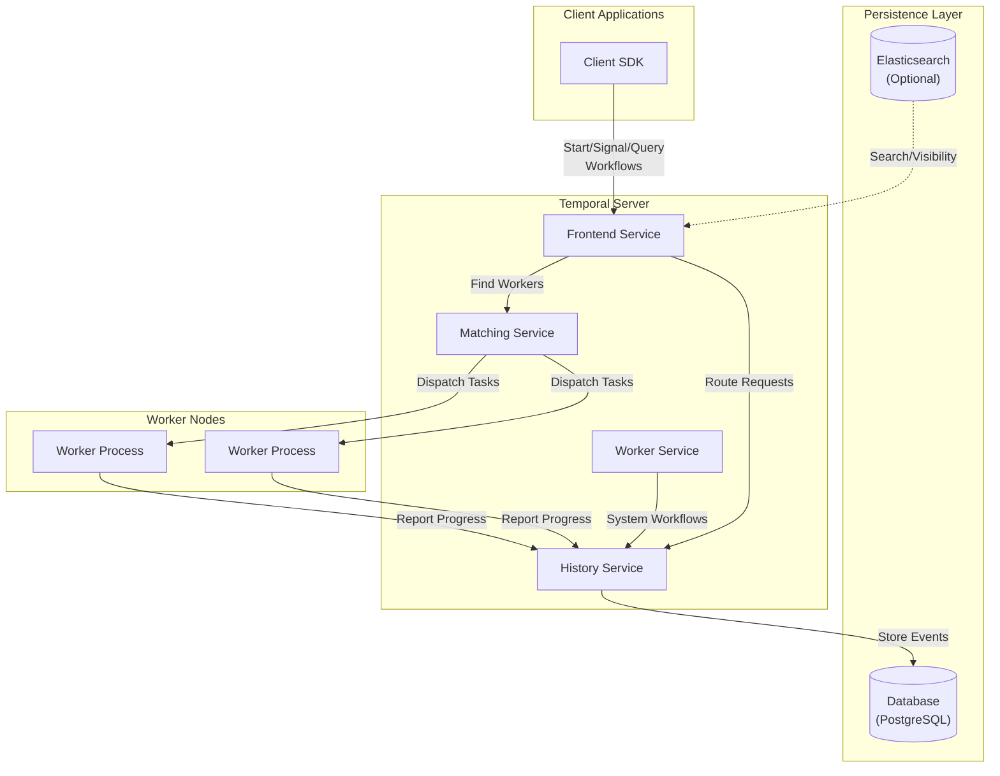

# Temporal Workflow Engine

## What is Temporal?

Temporal is an open-source, distributed, and scalable workflow orchestration platform designed to execute business logic reliably, especially for long-running processes. It provides durable execution guarantees, ensuring that workflows continue to progress despite failures in the underlying infrastructure or application code.

## How Temporal Works

Temporal's architecture separates workflow logic definition from its execution, creating a resilient system that can recover from failures automatically.

### Core Architecture



### Key Components

1. **Frontend Service**: Handles client requests, validates them, and routes them to appropriate internal services.

2. **History Service**: Maintains the source of truth for workflow executions by storing events in the persistence layer.

3. **Matching Service**: Matches workflow and activity tasks to available workers through task queues.

4. **Worker Service**: Runs system workflows for internal operations.

5. **Persistence Layer**: Stores workflow history, task queues, and namespace metadata (typically in PostgreSQL).

6. **Worker Nodes**: External processes that implement and execute workflow and activity logic.

### Execution Model

Temporal's execution model is based on event sourcing and state machines:

1. **Event Sourcing**: Every action in a workflow generates an event that is recorded in the workflow history.

2. **Deterministic Replay**: Workers can reconstruct workflow state by replaying the history events in sequence.

3. **Task Queues**: Serve as the connection point between the Temporal server and worker processes.

4. **Namespaces**: Provide isolation between different applications or teams using the same Temporal cluster.

## Configuring Temporal for New Microservices

### Updating dynamicconfig/docker.yaml

When adding a new microservice that uses Temporal, you need to update the `dynamicconfig/docker.yaml` file to configure namespace-specific settings. Here's how to do it:

1. **Add Namespace-Specific Configurations**

For a new microservice named `order-service`, add the following sections:

```yaml
# Workflow task timeout for order-service namespace
workflow.workflowTaskTimeout:
  - value: "10s"
    constraints:
      namespace: "order-service"

# Workflow execution timeout
workflow.workflowExecutionTimeout:
  - value: "30m"
    constraints:
      namespace: "order-service"

# Workflow run timeout
workflow.workflowRunTimeout:
  - value: "30m"
    constraints:
      namespace: "order-service"

# Activity task timeout and retry policy
workflow.defaultActivityRetryPolicy:
  - value:
      initialIntervalInSeconds: 1
      maximumIntervalInSeconds: 100
      maximumAttempts: 3
      backoffCoefficient: 2.0
    constraints:
      namespace: "order-service"

# Task queue settings for order-service-task-queue
limit.maxTaskQueuePollers:
  - value: 10
    constraints:
      namespace: "order-service"
      taskQueueName: "order-service-task-queue"

# Workflow history settings
history.maximumMutableStateSize:
  - value: 15
    constraints:
      namespace: "order-service"

# Worker settings
worker.enableStickyQuery:
  - value: true
    constraints:
      namespace: "order-service"

# Visibility settings
system.visibilityDisableOrderByClause:
  - value: false
    constraints:
      namespace: "order-service"
```

2. **Configuration Parameters Explained**

- `workflow.workflowTaskTimeout`: Maximum time allowed for a worker to process a workflow task
- `workflow.workflowExecutionTimeout`: Maximum time a workflow execution can run
- `workflow.workflowRunTimeout`: Maximum time a single workflow run can take
- `workflow.defaultActivityRetryPolicy`: Default retry policy for activities
- `limit.maxTaskQueuePollers`: Maximum number of pollers for a task queue
- `history.maximumMutableStateSize`: Maximum size of mutable state in MB
- `worker.enableStickyQuery`: Enable sticky query for better performance

3. **Apply the Configuration**

After updating the file, restart the Temporal service to apply the changes:

```bash
docker compose -p saaster restart temporal
```

4. **Register the Namespace**

Use the Temporal CLI to register the new namespace:

```bash
docker exec temporal-admin-tools tctl --ns order-service namespace register --retention 1
```

## Implementing Workflows and Activities in Go Microservices

### Project Structure

A typical Go microservice using Temporal should have the following structure:

```
order-service/
├── cmd/
│   └── server/
│       └── main.go           # Service entry point
├── internal/
│   ├── activities/
│   │   └── order_activities.go  # Activity implementations
│   ├── workflows/
│   │   └── order_workflows.go   # Workflow implementations
│   └── worker/
│       └── worker.go         # Temporal worker setup
└── pkg/
    └── models/
        └── order.go          # Shared data models
```

### Step 1: Add Temporal SDK Dependencies

```bash
go get go.temporal.io/sdk@latest
```

### Step 2: Define Workflow

In `internal/workflows/order_workflows.go`:

```go
package workflows

import (
	"time"

	"go.temporal.io/sdk/workflow"
	"your-project/order-service/internal/activities"
	"your-project/order-service/pkg/models"
)

// CreateOrderWorkflow handles the order creation process
func CreateOrderWorkflow(ctx workflow.Context, orderRequest models.OrderRequest) (models.Order, error) {
	// Workflow options
	ctx = workflow.WithActivityOptions(ctx, workflow.ActivityOptions{
		StartToCloseTimeout: 10 * time.Minute,
		RetryPolicy: &temporal.RetryPolicy{
			InitialInterval:    time.Second,
			BackoffCoefficient: 2.0,
			MaximumInterval:    time.Minute,
			MaximumAttempts:    5,
		},
	})

	// Step 1: Validate order
	var validatedOrder models.Order
	err := workflow.ExecuteActivity(ctx, activities.ValidateOrder, orderRequest).Get(ctx, &validatedOrder)
	if err != nil {
		return models.Order{}, err
	}

	// Step 2: Process payment
	var paymentResult models.PaymentResult
	err = workflow.ExecuteActivity(ctx, activities.ProcessPayment, validatedOrder).Get(ctx, &paymentResult)
	if err != nil {
		// Compensating action for failure
		_ = workflow.ExecuteActivity(ctx, activities.CancelOrder, validatedOrder.ID).Get(ctx, nil)
		return models.Order{}, err
	}

	// Step 3: Fulfill order
	var fulfilledOrder models.Order
	err = workflow.ExecuteActivity(ctx, activities.FulfillOrder, validatedOrder).Get(ctx, &fulfilledOrder)
	if err != nil {
		// Compensating action for failure
		_ = workflow.ExecuteActivity(ctx, activities.RefundPayment, paymentResult.TransactionID).Get(ctx, nil)
		return models.Order{}, err
	}

	// Step 4: Send confirmation
	err = workflow.ExecuteActivity(ctx, activities.SendOrderConfirmation, fulfilledOrder).Get(ctx, nil)
	if err != nil {
		workflow.GetLogger(ctx).Error("Failed to send confirmation, but order is processed", "error", err)
	}

	return fulfilledOrder, nil
}
```

### Step 3: Define Activities

In `internal/activities/order_activities.go`:

```go
package activities

import (
	"context"

	"your-project/order-service/pkg/models"
)

// ValidateOrder validates the order request
func ValidateOrder(ctx context.Context, request models.OrderRequest) (models.Order, error) {
	// Implement validation logic
	order := models.Order{
		ID:        generateOrderID(),
		CustomerID: request.CustomerID,
		Items:     request.Items,
		Status:    "VALIDATED",
		CreatedAt: time.Now(),
	}

	return order, nil
}

// ProcessPayment processes payment for the order
func ProcessPayment(ctx context.Context, order models.Order) (models.PaymentResult, error) {
	// Implement payment processing logic
	result := models.PaymentResult{
		OrderID:       order.ID,
		TransactionID: generateTransactionID(),
		Status:        "COMPLETED",
		Amount:        calculateTotal(order.Items),
	}

	return result, nil
}

// FulfillOrder fulfills the order
func FulfillOrder(ctx context.Context, order models.Order) (models.Order, error) {
	// Implement order fulfillment logic
	order.Status = "FULFILLED"
	order.FulfilledAt = time.Now()

	return order, nil
}

// SendOrderConfirmation sends order confirmation to the customer
func SendOrderConfirmation(ctx context.Context, order models.Order) error {
	// Implement confirmation sending logic
	return nil
}

// CancelOrder cancels an order
func CancelOrder(ctx context.Context, orderID string) error {
	// Implement order cancellation logic
	return nil
}

// RefundPayment refunds a payment
func RefundPayment(ctx context.Context, transactionID string) error {
	// Implement payment refund logic
	return nil
}
```

### Step 4: Set Up Worker

In `internal/worker/worker.go`:

```go
package worker

import (
	"log"

	"go.temporal.io/sdk/client"
	"go.temporal.io/sdk/worker"
	"your-project/order-service/internal/activities"
	"your-project/order-service/internal/workflows"
)

// StartWorker initializes and starts the Temporal worker
func StartWorker(temporalAddress string) error {
	// Create Temporal client
	c, err := client.Dial(client.Options{
		HostPort:  temporalAddress,
		Namespace: "order-service",
	})
	if err != nil {
		return err
	}
	defer c.Close()

	// Create worker
	w := worker.New(c, "order-service-task-queue", worker.Options{})

	// Register workflows
	w.RegisterWorkflow(workflows.CreateOrderWorkflow)

	// Register activities
	w.RegisterActivity(activities.ValidateOrder)
	w.RegisterActivity(activities.ProcessPayment)
	w.RegisterActivity(activities.FulfillOrder)
	w.RegisterActivity(activities.SendOrderConfirmation)
	w.RegisterActivity(activities.CancelOrder)
	w.RegisterActivity(activities.RefundPayment)

	// Start worker
	log.Println("Starting Temporal worker")
	err = w.Run(worker.InterruptCh())
	if err != nil {
		return err
	}

	return nil
}
```

### Step 5: Initialize Worker in Main

In `cmd/server/main.go`:

```go
package main

import (
	"log"
	"os"
	"os/signal"
	"syscall"

	"your-project/order-service/internal/worker"
)

func main() {
	// Start the Temporal worker in a separate goroutine
	go func() {
		err := worker.StartWorker("temporal:7233")
		if err != nil {
			log.Fatalf("Failed to start Temporal worker: %v", err)
		}
	}()

	// Start your service (HTTP server, gRPC server, etc.)
	// ...

	// Wait for termination signal
	sigCh := make(chan os.Signal, 1)
	signal.Notify(sigCh, syscall.SIGINT, syscall.SIGTERM)
	<-sigCh
	log.Println("Shutting down...")
}
```

### Step 6: Client Code to Start Workflows

Example of how to start a workflow from another service or API endpoint:

```go
func StartOrderWorkflow(ctx context.Context, orderRequest models.OrderRequest) (string, error) {
	// Create Temporal client
	c, err := client.Dial(client.Options{
		HostPort:  "temporal:7233",
		Namespace: "order-service",
	})
	if err != nil {
		return "", err
	}
	defer c.Close()

	// Start workflow
	workflowOptions := client.StartWorkflowOptions{
		ID:        "order-" + uuid.New().String(),
		TaskQueue: "order-service-task-queue",
	}

	we, err := c.ExecuteWorkflow(ctx, workflowOptions, workflows.CreateOrderWorkflow, orderRequest)
	if err != nil {
		return "", err
	}

	return we.GetID(), nil
}
```

## Advanced Temporal Features

### Signals

Signals allow external events to be sent to a running workflow:

```go
// In workflow definition
func OrderWorkflowWithSignals(ctx workflow.Context, orderID string) error {
	// Define signal channel
	updateSignal := workflow.GetSignalChannel(ctx, "order-update-signal")

	// Process signals
	for {
		var update models.OrderUpdate
		selector := workflow.NewSelector(ctx)

		selector.AddReceive(updateSignal, func(c workflow.ReceiveChannel, more bool) {
			c.Receive(ctx, &update)
			workflow.GetLogger(ctx).Info("Received order update", "update", update)
			// Process update
		})

		selector.Select(ctx)
	}
}

// Sending a signal from client
func SendOrderUpdate(ctx context.Context, workflowID string, update models.OrderUpdate) error {
	c, err := client.Dial(client.Options{
		HostPort:  "temporal:7233",
		Namespace: "order-service",
	})
	if err != nil {
		return err
	}
	defer c.Close()

	return c.SignalWorkflow(ctx, workflowID, "", "order-update-signal", update)
}
```

### Queries

Queries allow reading the current state of a workflow without affecting its execution:

```go
// In workflow definition
func OrderWorkflowWithQuery(ctx workflow.Context, orderID string) error {
	// Workflow state
	state := &models.OrderState{
		OrderID: orderID,
		Status:  "CREATED",
	}

	// Register query handler
	err := workflow.SetQueryHandler(ctx, "getOrderState", func() (models.OrderState, error) {
		return *state, nil
	})
	if err != nil {
		return err
	}

	// Workflow implementation
	// ...

	return nil
}

// Querying from client
func GetOrderState(ctx context.Context, workflowID string) (models.OrderState, error) {
	c, err := client.Dial(client.Options{
		HostPort:  "temporal:7233",
		Namespace: "order-service",
	})
	if err != nil {
		return models.OrderState{}, err
	}
	defer c.Close()

	var result models.OrderState
	err = c.QueryWorkflow(ctx, workflowID, "", "getOrderState", &result)
	return result, err
}
```

### Child Workflows

Child workflows allow breaking down complex processes into smaller, reusable components:

```go
func ParentOrderWorkflow(ctx workflow.Context, orderID string) error {
	// Start child workflow
	cwo := workflow.ChildWorkflowOptions{
		WorkflowID: "process-payment-" + orderID,
		TaskQueue:  "order-service-task-queue",
	}
	ctx = workflow.WithChildOptions(ctx, cwo)

	var paymentResult models.PaymentResult
	err := workflow.ExecuteChildWorkflow(ctx, PaymentWorkflow, orderID).Get(ctx, &paymentResult)
	if err != nil {
		return err
	}

	// Continue with parent workflow
	return nil
}

func PaymentWorkflow(ctx workflow.Context, orderID string) (models.PaymentResult, error) {
	// Payment workflow implementation
	// ...
	return result, nil
}
```

## Best Practices

1. **Deterministic Workflows**: Ensure workflow code is deterministic (same inputs produce same outputs).

2. **Activity Timeouts**: Set appropriate timeouts for activities based on their expected duration.

3. **Retry Policies**: Configure retry policies for activities that may fail due to transient issues.

4. **Idempotent Activities**: Design activities to be idempotent to handle retries safely.

5. **Error Handling**: Implement proper error handling with compensating actions for failed activities.

6. **Versioning**: Use workflow.GetVersion() for backward-compatible workflow changes.

7. **Testing**: Write unit tests for workflows and activities using Temporal's testing framework.

8. **Monitoring**: Implement metrics and logging for observability.

9. **Task Queue Management**: Use separate task queues for different types of workflows or priorities.

10. **Workflow Size**: Keep workflows focused and use child workflows for complex processes.
