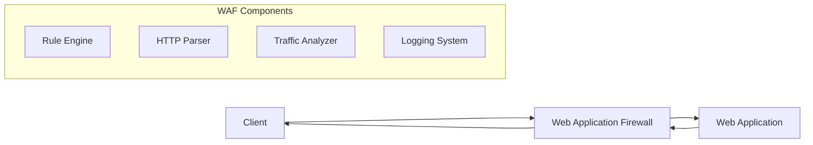
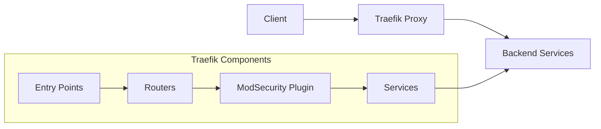

# Traefik and ModSecurity WAF

## What is a Web Application Firewall (WAF)?

A Web Application Firewall (WAF) is a security solution that monitors, filters, and blocks HTTP traffic to and from a web application. Unlike traditional firewalls that operate at the network or transport layer, WAFs work at the application layer (Layer 7 of the OSI model), allowing them to analyze the content of web requests and responses.

### How WAFs Work



WAFs operate through the following mechanisms:

1. **Traffic Inspection**: Examines all HTTP/HTTPS requests and responses.

2. **Rule-Based Filtering**: Applies predefined or custom security rules to identify malicious patterns.

3. **Anomaly Detection**: Identifies deviations from normal traffic patterns.

4. **Protection Against Common Attacks**:
   - SQL Injection (SQLi)
   - Cross-Site Scripting (XSS)
   - Cross-Site Request Forgery (CSRF)
   - Command Injection
   - Path Traversal
   - Local File Inclusion (LFI)
   - Remote File Inclusion (RFI)
   - Unvalidated Redirects

5. **Operational Modes**:
   - **Detection Mode**: Logs potential attacks without blocking them
   - **Prevention Mode**: Actively blocks malicious requests
   - **Learning Mode**: Builds a baseline of normal behavior

## Traefik and ModSecurity Integration

Traefik is a modern HTTP reverse proxy and load balancer that integrates with ModSecurity, a powerful open-source WAF, through a plugin system.

### Architecture



### How It Works

1. **Request Flow**:
   - Client sends a request to Traefik
   - Traefik routes the request based on defined rules
   - ModSecurity plugin analyzes the request against security rules
   - If the request passes security checks, it's forwarded to the backend service
   - The response follows the same path in reverse

2. **ModSecurity Features**:
   - Core Rule Set (CRS) implementation
   - Custom rule definitions
   - Paranoia levels for security strictness
   - Detailed logging of security events
   - Virtual patching for known vulnerabilities

3. **Integration Benefits**:
   - Seamless security layer without additional infrastructure
   - Dynamic rule updates without service interruption
   - Centralized security policy management
   - Detailed security logging and monitoring

## Configuration Files

### 1. Main Configuration: `config/traefik.yml`

This file contains the global Traefik configuration.

```yaml
global:
  checkNewVersion: true  # Check for new Traefik versions
  sendAnonymousUsage: false  # Don't send usage statistics

api:
  dashboard: true  # Enable the web dashboard
  insecure: true  # Allow insecure access to dashboard (dev only)

log:
  level: INFO  # Logging level

entryPoints:  # Define entry points (ports)
  web:  # HTTP entry point
    address: ":80"
    http:
      redirections:  # Redirect HTTP to HTTPS
        entryPoint:
          to: websecure
          scheme: https
  websecure:  # HTTPS entry point
    address: ":443"
  traefik:  # Dashboard entry point
    address: ":8080"

providers:  # Configuration providers
  docker:  # Docker provider
    endpoint: "unix:///var/run/docker.sock"
    exposedByDefault: false
    watch: true
    network: saaster-network
  file:  # File provider
    directory: "/etc/traefik/dynamic"
    watch: true

experimental:  # Experimental features
  plugins:
    modsecurity:  # ModSecurity plugin
      moduleName: github.com/traefik/modsecurity-plugin
      version: v0.1.0
```

#### How to Modify

- **Entry Points**: Add or modify entry points to change listening ports or protocols
  ```yaml
  entryPoints:
    custom:
      address: ":8443"
  ```

- **Logging**: Adjust log levels for troubleshooting
  ```yaml
  log:
    level: DEBUG  # Options: DEBUG, INFO, WARN, ERROR
    filePath: "/path/to/traefik.log"  # Optional log file
  ```

- **Docker Provider**: Configure how Traefik discovers Docker containers
  ```yaml
  providers:
    docker:
      defaultRule: "Host(`{{ normalize .Name }}.example.com`)"  # Default routing rule
      constraints: "Label(`traefik.enable`, `true`)"
  ```

- **Plugins**: Add or update plugins
  ```yaml
  experimental:
    plugins:
      newplugin:
        moduleName: github.com/example/plugin
        version: v1.0.0
  ```

### 2. Middlewares Configuration: `dynamic/middlewares.yml`

This file defines middleware chains, including the ModSecurity WAF configuration.

```yaml
http:
  middlewares:
    kong-waf:  # ModSecurity middleware for Kong
      plugin:
        moduleName: github.com/traefik/modsecurity-plugin
        version: v0.1.0
        type: middleware
        config:
          connector:
            secRuleEngine: DetectionOnly  # Mode: DetectionOnly or On
            requestBodyAccess: On  # Allow request body inspection
            responseBodyAccess: On  # Allow response body inspection
            secRules:  # Security rules
              - SecRuleEngine On
              - SecRequestBodyAccess On
              - SecResponseBodyAccess On
              # XML content type handling
              - SecRule REQUEST_HEADERS:Content-Type "(?:application(?:/soap\+|/)|text/)xml" "id:1000,phase:1,t:none,t:lowercase,pass,nolog,ctl:requestBodyProcessor=XML"
              # JSON content type handling
              - SecRule REQUEST_HEADERS:Content-Type "application/json" "id:1001,phase:1,t:none,t:lowercase,pass,nolog,ctl:requestBodyProcessor=JSON"
              # XSS protection
              - SecRule ARGS_NAMES|ARGS|XML:/* "@rx (?i)([<>;]|javascript:|vbscript:|expression:|url\s*\(|document\.|alert\s*\(|eval\s*\()" "id:1002,phase:2,t:none,block,msg:'XSS Attack'"
              # SQL Injection protection
              - SecRule ARGS_NAMES|ARGS|REQUEST_BODY "@rx (?i)(select|union|insert|update|delete|drop|alter)\s+.*\s+(from|into|where)" "id:1003,phase:2,t:none,block,msg:'SQL Injection'"
```

#### How to Modify

- **Add New Middleware**:
  ```yaml
  http:
    middlewares:
      rate-limit:
        rateLimit:
          average: 100
          burst: 50
  ```

- **Change ModSecurity Mode**:
  ```yaml
  # Change from DetectionOnly (log only) to On (block)
  secRuleEngine: On
  ```

- **Add Custom Security Rules**:
  ```yaml
  secRules:
    # Block specific User-Agent
    - SecRule REQUEST_HEADERS:User-Agent "@contains badbot" "id:1004,phase:1,t:none,block,msg:'Bad Bot Detected'"
    # Block specific IP ranges
    - SecRule REMOTE_ADDR "@ipMatch 192.168.1.0/24" "id:1005,phase:1,t:none,block,msg:'Blocked IP Range'"
  ```

- **Implement OWASP Core Rule Set**:
  ```yaml
  secRules:
    - Include /etc/modsecurity.d/owasp-crs/crs-setup.conf
    - Include /etc/modsecurity.d/owasp-crs/rules/*.conf
  ```

### 3. TLS Configuration: `dynamic/tls.yml`

This file configures TLS settings for secure connections.

```yaml
tls:
  options:
    default:  # Default TLS options
      minVersion: VersionTLS12  # Minimum TLS version
      sniStrict: true  # Strict SNI checking
      cipherSuites:  # Allowed cipher suites
        - TLS_ECDHE_ECDSA_WITH_AES_256_GCM_SHA384
        - TLS_ECDHE_RSA_WITH_AES_256_GCM_SHA384
        - TLS_ECDHE_ECDSA_WITH_AES_128_GCM_SHA256
        - TLS_ECDHE_RSA_WITH_AES_128_GCM_SHA256
        - TLS_ECDHE_ECDSA_WITH_CHACHA20_POLY1305
        - TLS_ECDHE_RSA_WITH_CHACHA20_POLY1305
```

#### How to Modify

- **TLS Versions**:
  ```yaml
  tls:
    options:
      modern:
        minVersion: VersionTLS13  # Only TLS 1.3
      compatible:
        minVersion: VersionTLS12  # TLS 1.2 and above
  ```

- **Certificate Configuration**:
  ```yaml
  tls:
    certificates:
      - certFile: /path/to/cert.pem
        keyFile: /path/to/key.pem
    stores:
      default:
        defaultCertificate:
          certFile: /path/to/default-cert.pem
          keyFile: /path/to/default-key.pem
  ```

- **Let's Encrypt Integration**:
  ```yaml
  certificatesResolvers:
    letsencrypt:
      acme:
        email: admin@example.com
        storage: /etc/traefik/acme.json
        httpChallenge:
          entryPoint: web
  ```

## Tips and Tricks

### Traefik Tips

1. **Dashboard Security**: In production, secure the dashboard with authentication:
   ```yaml
   api:
     dashboard: true
     insecure: false

   http:
     middlewares:
       dashboard-auth:
         basicAuth:
           users:
             - "admin:$apr1$H6uskkkW$IgXLP6ewTrSuBkTrqE8wj/"

   http:
     routers:
       dashboard:
         rule: "Host(`traefik.example.com`)"
         service: "api@internal"
         middlewares:
           - dashboard-auth
         tls:
           certResolver: letsencrypt
   ```

2. **Health Checks**: Add health checks to ensure backend services are healthy:
   ```yaml
   http:
     services:
       my-service:
         loadBalancer:
           healthCheck:
             path: /health
             interval: "10s"
             timeout: "3s"
   ```

3. **Circuit Breaker**: Implement circuit breakers to prevent cascading failures:
   ```yaml
   http:
     middlewares:
       circuit-breaker:
         circuitBreaker:
           expression: "NetworkErrorRatio() > 0.5"
   ```

4. **Retry Mechanism**: Add retry logic for transient failures:
   ```yaml
   http:
     middlewares:
       retry-middleware:
         retry:
           attempts: 3
           initialInterval: "100ms"
   ```

5. **Access Logs**: Enable detailed access logs for troubleshooting:
   ```yaml
   accessLog:
     filePath: "/path/to/access.log"
     format: "json"
     fields:
       headers:
         defaultMode: "keep"
         names:
           User-Agent: "keep"
           Authorization: "redact"
           Content-Type: "keep"
   ```

### ModSecurity Tips

1. **Paranoia Levels**: Adjust security strictness with paranoia levels:
   ```yaml
   secRules:
     - "SecRuleEngine On"
     - "SecParanoiaLevel 2"  # 1 (less strict) to 4 (very strict)
   ```

2. **Whitelist Known IPs**: Allow trusted IP addresses to bypass certain rules:
   ```yaml
   secRules:
     - "SecRule REMOTE_ADDR '@ipMatch 10.0.0.0/8,192.168.0.0/16' 'id:1000,phase:1,allow'"
   ```

3. **Custom Error Pages**: Configure custom error responses for blocked requests:
   ```yaml
   secRules:
     - "SecDefaultAction 'phase:1,log,deny,status:403,redirect:/blocked.html'"
   ```

4. **Performance Tuning**: Optimize ModSecurity for performance:
   ```yaml
   secRules:
     - "SecRuleEngine On"
     - "SecRequestBodyLimit 13107200"
     - "SecRequestBodyNoFilesLimit 131072"
     - "SecRequestBodyInMemoryLimit 131072"
   ```

5. **Selective Rule Application**: Apply rules only to specific paths:
   ```yaml
   secRules:
     - "SecRule REQUEST_URI '@beginsWith /api/' 'id:1000,phase:1,pass,nolog,ctl:ruleEngine=On'"
     - "SecRule REQUEST_URI '!@beginsWith /api/' 'id:1001,phase:1,pass,nolog,ctl:ruleEngine=Off'"
   ```

6. **Logging and Debugging**: Enable detailed logging for troubleshooting:
   ```yaml
   secRules:
     - "SecDebugLog /var/log/modsec_debug.log"
     - "SecDebugLogLevel 3"  # 0-9, higher is more verbose
     - "SecAuditLog /var/log/modsec_audit.log"
     - "SecAuditLogParts ABIJDEFHZ"  # Log parts to include
   ```

7. **Virtual Patching**: Quickly address new vulnerabilities without application changes:
   ```yaml
   secRules:
     - "SecRule REQUEST_URI '@contains vulnerable-page.php' 'id:10000,phase:1,deny,status:403,msg:Temporarily blocked due to CVE-2023-XXXXX'"
   ```

8. **False Positive Handling**: Disable specific rules causing false positives:
   ```yaml
   secRules:
     - "SecRuleRemoveById 942100"  # Disable specific rule
     - "SecRuleRemoveByTag 'WEB_ATTACK/XSS'"  # Disable rules by tag
   ```

## Monitoring and Troubleshooting

### Monitoring

1. **Prometheus Integration**:
   ```yaml
   metrics:
     prometheus:
       entryPoint: metrics
       addServicesLabels: true
       addEntryPointsLabels: true
       buckets:
         - 0.1
         - 0.3
         - 1.2
         - 5.0
   ```

2. **ModSecurity Audit Logs**: Monitor `/var/log/modsec_audit.log` for security events.

### Troubleshooting

1. **Debug Mode**: Enable debug logging in Traefik:
   ```yaml
   log:
     level: DEBUG
   ```

2. **Rule Testing**: Test ModSecurity rules with the `modsec-sftw` tool before deployment.

3. **Common Issues**:
   - **403 Forbidden**: Check ModSecurity rules for false positives
   - **502 Bad Gateway**: Check backend service health
   - **TLS Handshake Failures**: Verify certificate and cipher suite compatibility
